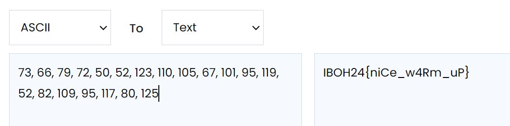
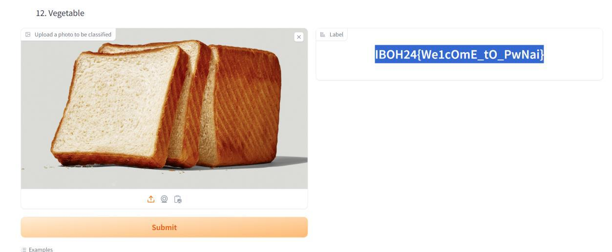
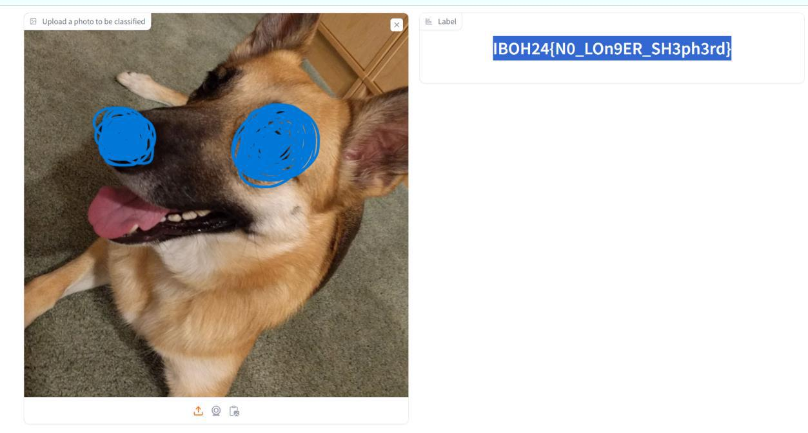
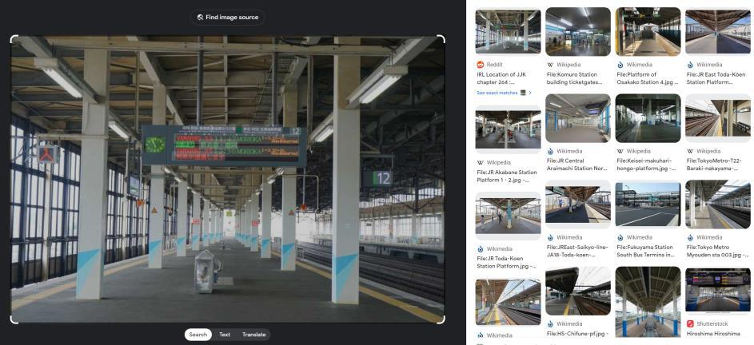
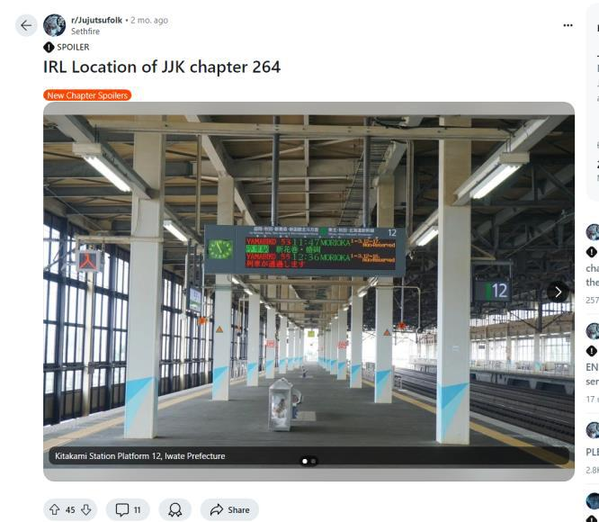
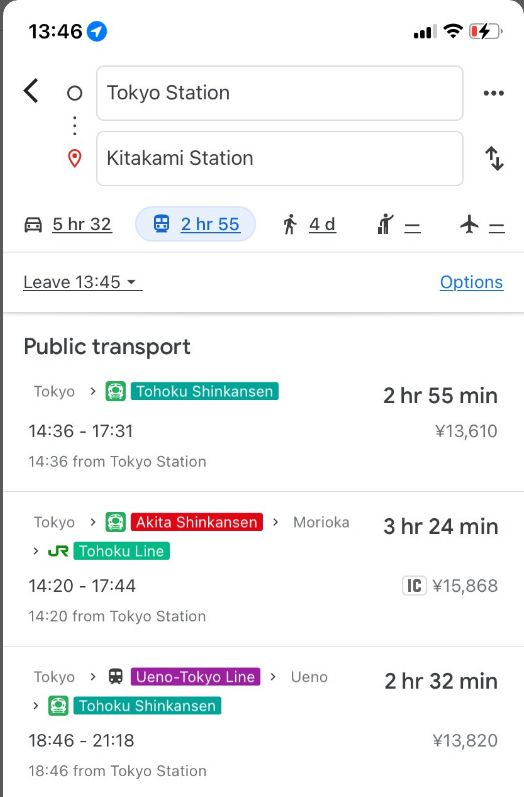
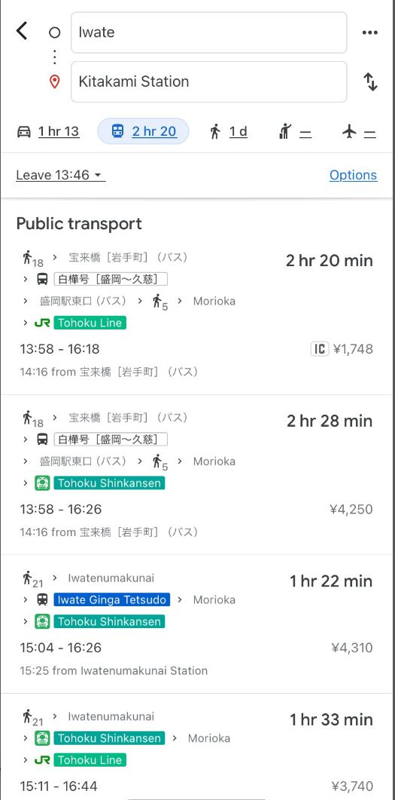
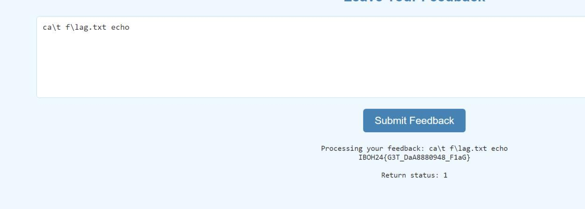

# IBOH24

My writeup only

## Reverse Engineering - Reverse Me

The file couldn't run. Running strings on the file:

```bash
$ strings ReverseMe 
tnemmoc. 
ssb. 
atad. 
tlp.tog. 
cimanyd. 
yarra_inif. 
yarra_tini. 
emarf_he. 
rdh_emarf_he. 
atador. 
inif. 
txet. 
tog.tlp. 
tini. 
tlp.aler. 
nyd.aler. 
r_noisrev.ung. 
noisrev.ung. 
rtsnyd. 
mysnyd. 
hsah.ung. 
gat-IBA.eton. 
di-dliub.ung.eton. 
ytreporp.ung.eton. 
… 
```

First look like its gibberish. But its actually reversed. main become niam, etc. Make a script to reverse the strings in the original file
&#x20;and make new file

```python
def reverse_file(input_file, output_file): 
    with open(input_file, 'rb') as f: 
        content = f.read() 
 
    # Reverse the content 
    reversed_content = content[::-1] 
 
    with open(output_file, 'wb') as f: 
        f.write(reversed_content) 
 
    print(f"Reversed file written to: {output_file}") 
 
if __name__ == "__main__": 
    input_file = './ReverseMe' 
    output_file = './ReversedReverseMe' 
 
    reverse_file(input_file, output_file) 
```

Then run the output file

```bash
$ ./ReversedReverseMe 
33 39 42 32 87 81 19 11 12 43 0 58 31 81 55 5 58 16 56 24 
```

Open decompiler


```c
int __cdecl main(int argc, const char **argv, const char **envp) 
{ 
  int v3; // ebx 
  char v5[87]; // [rsp+9h] [rbp-C7h] BYREF 
  char s[72]; // [rsp+60h] [rbp-70h] BYREF 
  int v7; // [rsp+A8h] [rbp-28h] 
  int j; // [rsp+ACh] [rbp-24h] 
  int i; // [rsp+B0h] [rbp-20h] 
  int v10; // [rsp+B4h] [rbp-1Ch] 
  char *nptr; // [rsp+B8h] [rbp-18h] 
 
  strcpy(s, "33 39 42 32 87 81 19 11 12 43 0 58 31 81 55 5 58 16 56 24"); 
  nptr = strtok(s, " "); 
  v10 = 0; 
  while ( nptr ) 
  { 
    v3 = v10++; 
    *(_DWORD *)&v5[4 * v3 + 7] = atoi(nptr); 
    nptr = strtok(0LL, " "); 
  } 
  for ( i = 0; i < v10; ++i ) 
    printf("%d ", *(unsigned int *)&v5[4 * i + 7]); 
  putchar(10); 
  strcpy(v5, "heehee"); 
  v7 = 6; 
  for ( j = 0; j < v10; ++j ) 
    *(_DWORD *)&v5[4 * j + 7] ^= v5[j % v7]; 
  return 0;
}
```


The main takes a string of space-separated numbers, s, converts them into integers, and then
\
performs an XOR operation on them using the string "heehee". So make a script to xor it.

```python
numbers = [33, 39, 42, 32, 87, 81, 19, 11, 12, 43, 0, 58, 31, 81, 55, 5, 58, 16, 56, 24] 
 
xor_key = [ord(c) for c in "heehee"] 
 
key_len = len(xor_key) 
 
decrypted_numbers = [] 
 
for i in range(len(numbers)): 
    decrypted_value = numbers[i] ^ xor_key[i % key_len]  # XOR again to undo 
    decrypted_numbers.append(decrypted_value) 
 
print("Decrypted numbers:", decrypted_numbers)
```

Then convert to ascii

<figure><figcaption></figcaption></figure>

Flag: IBOH24{niCe\_w4Rm\_uP}

***

## AI - PwnAI Warmup

I just give a random bread png

<figure><figcaption></figcaption></figure>

Flag: IBOH{We1cOmE\_tO\_PwNai}

***

## AI - PwnAI

Making the dog less “dog” can fool the AI.

<figure><figcaption></figcaption></figure>


***

## OSINT - Ryoiki Tenkai

When reverse search the image found Jujutsu Kaisen reference because Ryoiki Tenkai is the
\
anime trademark.

<figure><figcaption></figcaption></figure>

The reddit shows the Station name

<figure><figcaption></figcaption></figure>

After some exploring there is only Tohoku line in Kitakami Station. But Tohoku got two line,
\
Tohoku line and Tohoku shinkansen.

<figure><figcaption></figcaption></figure>

<figure><figcaption></figcaption></figure>

So we craft the flag using the three line and rearrange until get the correct arrangement.
\
Flag: IBOH24{KitakamiLine\_TōhokuMainLine\_TōhokuShinkansenLine}

***

## Web - echo ~~(cant remember the title)~~

Using all kind of different echo cat flag method from PatriotCTF2024 writeup and got the flag.
\
(Thanks RE:UNION members for solving PatriotCTF)

<figure><figcaption></figcaption></figure>

