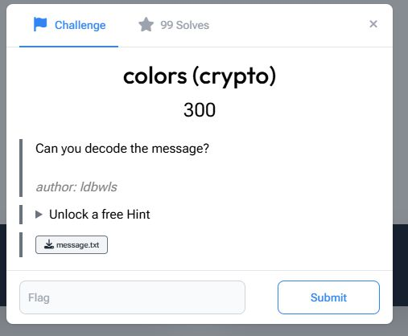
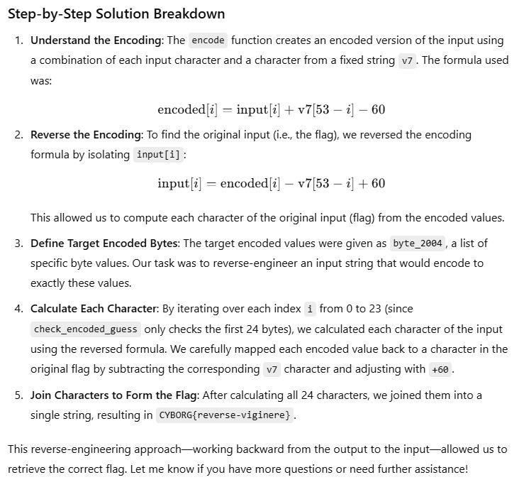
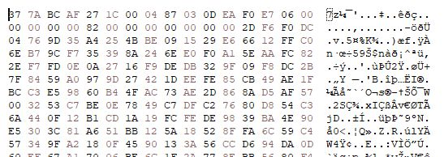
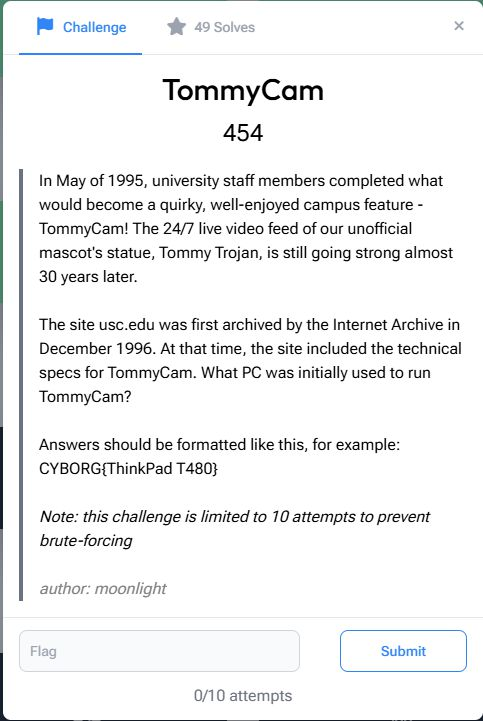
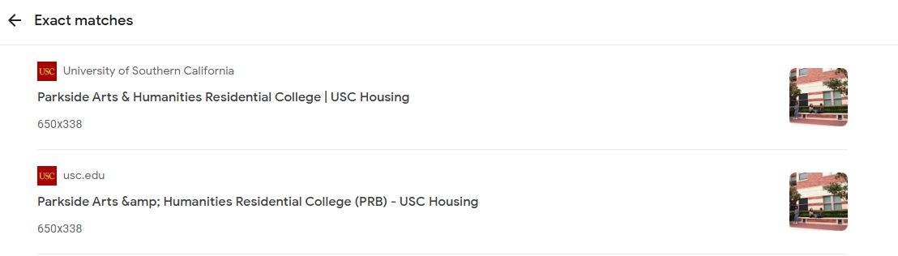
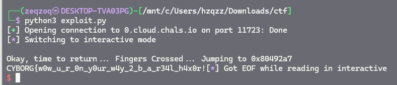

# USC 2024

## Crypto

### Colors

<figure><figcaption></figcaption></figure>

<figure><figcaption></figcaption></figure>

***

### unpopcorn

<figure><figcaption></figcaption></figure>

GPT!

<figure><figcaption></figcaption></figure>

***

### trynewthings

<figure><figcaption></figcaption></figure>

Another GPT because its crypto. OR is this RE? I dont remember

<figure><figcaption></figcaption></figure>

***

## Forensic

### weirdtraffic

<figure><figcaption></figcaption></figure>

Tap the arrow button like a mad man

<figure><figcaption></figcaption></figure>

***

### Think Twice

<figure><figcaption></figcaption></figure>

Typical forensic challenge

<figure><figcaption></figcaption></figure>

<figure><figcaption></figcaption></figure>

***

### pineapple

<figure><figcaption></figcaption></figure>

Follow tcp stream until 23rd

<figure><figcaption></figcaption></figure>

This tcp got 7z
. Then save the http object. Eventhough the file name is different but the content is same.

<figure><figcaption></figcaption></figure>

Then we want to make a file out of the exported object.
\
Put in hxd then edit. 7z need to be first. And at the bottom, delete --- to end

<figure><figcaption>
Head of the file
</figcaption></figure>

<figure><figcaption>
Tail of the file
</figcaption></figure>

Then got the 7z file.
\
The password for the file is at tcp stream 21st.

<figure><figcaption></figcaption></figure>

Then got image

<figure><figcaption></figcaption></figure>

***

## Web

### iRobots

<figure><figcaption></figcaption></figure>

<figure><figcaption></figcaption></figure>

<figure><figcaption></figcaption></figure>

***

### tictactocket

<figure><figcaption></figcaption></figure>

Clicked faster than the response.

<figure><figcaption></figcaption></figure>

***

### Tommy's Artventures

<figure><figcaption></figcaption></figure>

The reference:
&#x20;https://ctf.zeyu2001.com/2021/picoctf/most-cookies-150

<figure><figcaption></figcaption></figure>

<figure><figcaption></figcaption></figure>

Got the key

<figure><figcaption></figcaption></figure>

***

### tictacBINGO

<figure><figcaption></figcaption></figure>

<figure><figcaption></figcaption></figure>

<figure><figcaption></figcaption></figure>

***

## Reverse Engineering

### concoction

<figure><figcaption></figcaption></figure>

Open decompiler and got the condition. The ounces of water is just positive number.

<figure><figcaption></figcaption></figure>

<figure><figcaption></figcaption></figure>

***

### Computer has Virus

<figure><figcaption></figcaption></figure>

Got an exe file in the eml. Decode the payload with base64 and gunzip (cause its gzip
\
compression) to get flag.

<figure><figcaption></figcaption></figure>

<figure><figcaption></figcaption></figure>

***

### Basic Rust Rev

<figure><figcaption></figcaption></figure>

<figure><figcaption></figcaption></figure>

Found in code

<figure><figcaption></figcaption></figure>

<figure><figcaption></figcaption></figure>

***

## OSINT

### TommyCam

<figure><figcaption></figcaption></figure>

<figure><figcaption></figcaption></figure>

<figure><figcaption></figcaption></figure>

<figure><figcaption></figcaption></figure>

<figure><figcaption></figcaption></figure>

Flag: CYBORG{Toshiba 5200 80386}

***

### beer sales

<figure><figcaption></figcaption></figure>

<figure><figcaption></figcaption></figure>

Get’ the pdf file from the ftp server because cant download the pdf from the google url.

<figure><figcaption></figcaption></figure>

<figure><figcaption></figcaption></figure>

***

### Buildings

<figure><figcaption></figcaption></figure>

Exporting all the images from pdf (including deleted image)

<figure><figcaption></figcaption></figure>

<figure><figcaption></figcaption></figure>

<figure><figcaption></figcaption></figure>

From here we know all of it is from USC website.

<figure><figcaption></figcaption></figure>

<figure><figcaption></figcaption></figure>

<figure><figcaption></figcaption></figure>

<figure><figcaption></figcaption></figure>

<figure><figcaption></figcaption></figure>

<figure><figcaption></figcaption></figure>

CYBORG{BRICKS}

***

### television

<figure><figcaption></figcaption></figure>

<figure><figcaption></figcaption></figure>

<figure><figcaption></figcaption></figure>

<figure><figcaption></figcaption></figure>

<figure><figcaption></figcaption></figure>

<figure><figcaption></figcaption></figure>

***

## Misc

### decipherium

<figure><figcaption></figcaption></figure>

Map to periodic table. Then from decimal and from hex.

<figure><figcaption></figcaption></figure>

<figure><figcaption></figcaption></figure>

***

### Redwoods

Not sure if this is Misc or Reverse Engineering challenge

<figure><figcaption></figcaption></figure>

<figure><figcaption></figcaption></figure>

<figure><figcaption></figcaption></figure>

In the code got some sort of encrypted text. Then map it to this image and got brainfuck
\
code.

<figure><figcaption></figcaption></figure>

<figure><figcaption></figcaption></figure>

<figure><figcaption></figcaption></figure>

<figure><figcaption></figcaption></figure>

***

## Pwn

### Portal

<figure><figcaption></figcaption></figure>

ret2win challenge

<figure><figcaption></figcaption></figure>

The flag is in win()

<figure><figcaption></figcaption></figure>

Then finding the buffer offset with cyclic which is 44.

<figure><figcaption></figcaption></figure>

<figure><figcaption></figcaption></figure>

<figure><figcaption></figcaption></figure>

Get the address of the win()

<figure><figcaption></figcaption></figure>

Craft the payload and solve locally

<figure><figcaption></figcaption></figure>

Make a script to pass to the server.

<figure><figcaption></figcaption></figure>

<figure><figcaption></figcaption></figure>

