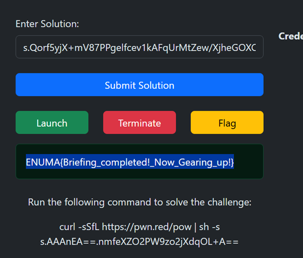

# Briefing

This is my first Blockchain challenge, preparing for UM Cybercamp. This part will be how I setup the challenges first. First we got 2 files, Setup.sol and Briefing.sol. here is the content:



```solidity
// SPDX-License-Identifier: MIT
pragma solidity ^0.8.25;
import "./Briefing.sol";

contract Setup{
    Briefing public brief;

    constructor(bytes32 _secretPhrase) payable{
        brief = new Briefing(_secretPhrase);
    }
    
    function isSolved() public view returns(bool){
        return brief.completedBriefing();
    }
}
```




```solidity
// SPDX-License-Identifier: MIT
pragma solidity ^0.8.25;

contract Briefing{
    bytes32 private secretPhrase;

    // Solved Tracker
    bool public completedCall;
    bool public completedInputation;
    bool public completedTransfer;
    bool public completedDeposit;
    bool public completedBriefing;

    constructor(bytes32 _secretPhrase){
        secretPhrase = _secretPhrase;
    }

    function verifyCall() public {
        completedCall = true;
    }

    function putSomething(uint256 _numberInput, string memory _nameInput, address _player) public{
        require(completedCall, "Accept the Call First!");
        require(_player == msg.sender, "player can only register their own address.");
        require(_numberInput == 1337, "Why not 1337?");
        require(keccak256(abi.encodePacked("Casino Heist Player")) == keccak256(abi.encodePacked(_nameInput)),"Join the game?");
        completedInputation = true;
    }

    function firstDeposit() public payable{
        require(completedCall, "Accept the Call First!");
        require(msg.sender == tx.origin, "This Ensure that you are a Human being, not a Contract");
        require(msg.value == 5 ether, "First deposit amount must be 5 ether");
        completedDeposit = true;
    }

    function Finalize(bytes32 _secret) public{
        require(
            completedCall &&
            completedDeposit &&
            completedInputation &&
            completedTransfer, "To Finalize, everything must be completed before!");
        require(msg.sender == tx.origin, "Only EOA is allowed!");
        if(keccak256(abi.encodePacked(secretPhrase)) == keccak256(abi.encodePacked(_secret))){
            completedBriefing = true;
        }
    }

    receive() external payable{
        if(msg.value == 1 ether){
            completedTransfer = true;
        }
    }
}

```


Firstly we need to setup our terminal session

<figure><figcaption><p>Ethernet Launcher</p></figcaption></figure>

[`https://casinoheist.xyz/`](https://casinoheist.xyz/) give us the ethernet launcher. To get the credential, we need to run the command

```bash
curl -sSfL https://pwn.red/pow | sh -s s.AAAnEA==.Wq+FcHp5dgz76GFU47siSg==
```

Then copy the value, insert it in Solution textbox and click `Launch`. You should get the Credentials.  There are two main way to solve blockchain challenge, one is using `Remix IDE` and another is using `Foundry`. For this chall, I'm just using Foundry.

Based on the credential, we now need to set to variables using `EXPORT`. Do note that it only set in the terminal session not globally

```bash
export RPC_URL=https://ip:port/your_key
export SetupADDR=0xYourSetupContractAddress
export PK=0xYourPrivateKey
```

If you're lost, here's the example

```bash
$ export RPC_URL=http://103.178.153.113:30001/0163a171-1ad4-4506-a700-1bfe0f68cae2
$ export SetupADDR=0xEe2266DBa22894Cd45D238d8501e7aE1De1761A2
$ export PK=0xb10521909ed8fdb2b8c321e53fd115e6a7218f5180d08dfa7274e3ae91489ec9
```

Lets get started. Our challenge contract is the Briefing.sol. But to interact with it, we need to get the address of the contract. We use cast call to interact without changing the state of the contract.

```bash
$ cast call -r $RPC_URL $SetupADDR "brief()"
0x000000000000000000000000cfa9c4820016b77dc1f37d83830652ef53f17942
```

Now we got the address. Lets assign it. We only take the last 20 hex as the 0s is just paddings.

```bash
$ export BriefADDR=0xcfa9c4820016b77dc1f37d83830652ef53f17942
```

there are variable completeCall() just to demonstate calling a variable.

```bash
$ cast call -r $RPC_URL $BriefADDR "completedCall()"
0x0000000000000000000000000000000000000000000000000000000000000000
```

0x0000000...0000 means its false. We use cast send to change the state like changing value, sending Ether, etc. To solve this challenge, we need to call `isSolved()` in `Setup.sol`. But to call that, `completedBriefing()` need to be true. To assign `completedBriefing()` to be true, we need to call `Finalize()` in Briefing.sol. You get the point? Now take your time to read through the code.

So first objective is to solve the `verifyCall()` since it is required by all the functions below it. Since it doesn't require any input, we can just simply call the function.&#x20;

```bash
$ cast send -r $RPC_URL --private-key $PK $BriefADDR "verifyCall()"

blockHash            0x4226b758aa377829d0ffc764b6b3c5d8b92641f7ee91116111f1b2be3963066c
blockNumber          2
contractAddress
cumulativeGasUsed    43342
effectiveGasPrice    881230416667
from                 0x5355d87A2bFab7a63c8eee8Ac49e55EB3A693664
gasUsed              43342
logs                 []
logsBloom            0x00000000000000000000000000000000000000000000000000000000000000000000000000000000000000000000000000000000000000000000000000000000000000000000000000000000000000000000000000000000000000000000000000000000000000000000000000000000000000000000000000000000000000000000000000000000000000000000000000000000000000000000000000000000000000000000000000000000000000000000000000000000000000000000000000000000000000000000000000000000000000000000000000000000000000000000000000000000000000000000000000000000000000000000000000000000
root
status               1 (success)
transactionHash      0x5adb75e8ec3f9126686233216fb54ff439381700111b10e14beb7152c0f069d1
transactionIndex     0
type                 2
blobGasPrice         1
blobGasUsed
authorizationList
to                   0xeAB19A6bAcb0CC1c82fd975aC73c6d1Ab84A9047
root                 80097502282978010599773223389586979000900448557094018271068820777362726256519
```

That is how to call the function. we need to specify the rpc url, private key and contract address given but challenge author. The status=1 (success) indicate that we called the function successfully.

The 2nd objective is to run `putSomething()`_._ This function required  `_numberInput` = 1337 and a string of _"Casino Heist Player"._ Solidity cannot compare a literal string, rather it can only compare the value of a hash like `keccak256`. The last thing is the address of _\_player_. So let's use our own provided address which is the _wallet_.&#x20;

```bash
$ export WalletADDR=0x5355d87A2bFab7a63c8eee8Ac49e55EB3A693664
```

Now lets run the command with the conditions

```bash
$ cast send -r $RPC_URL --private-key $PK $BriefADDR "putSomething(uint256,string,address)" 1337 "Casino Heist Player" $WalletADDR

blockHash            0x4db19484556f61439dd152afc696e49fdc8a7ca7939d7a59b7b17283ed7ab731
blockNumber          3
contractAddress
cumulativeGasUsed    28587
effectiveGasPrice    771519539140
from                 0x5355d87A2bFab7a63c8eee8Ac49e55EB3A693664
gasUsed              28587
logs                 []
logsBloom            0x00000000000000000000000000000000000000000000000000000000000000000000000000000000000000000000000000000000000000000000000000000000000000000000000000000000000000000000000000000000000000000000000000000000000000000000000000000000000000000000000000000000000000000000000000000000000000000000000000000000000000000000000000000000000000000000000000000000000000000000000000000000000000000000000000000000000000000000000000000000000000000000000000000000000000000000000000000000000000000000000000000000000000000000000000000000
root
status               1 (success)
transactionHash      0x70347d5791c5e881aa47d8893b89c7992366df5f07a7744481dc2bc177e150d7
transactionIndex     0
type                 2
blobGasPrice         1
blobGasUsed
authorizationList
to                   0xeAB19A6bAcb0CC1c82fd975aC73c6d1Ab84A9047
root                 112672449704598188740147477571105846134413361873164578159427118952592063692953
```

The 3rd is the function `firstDeposit()`, that requires you to send _5 Ether_ to it. There is also a validation that validates the `msg.sender == tx.origin`, this is a validation that forces the sender to be from an EOA account since the interactor and the origin must be the same.&#x20;

```bash
$ cast send -r $RPC_URL --private-key $PK $BriefADDR "firstDeposit()" --value 5ether

blockHash            0x218d161ffe6aa107752827e5fc293f21b0038fec80a1ddccd33bdcc5a4a1959f
blockNumber          4
contractAddress
cumulativeGasUsed    26418
effectiveGasPrice    675388153765
from                 0x5355d87A2bFab7a63c8eee8Ac49e55EB3A693664
gasUsed              26418
logs                 []
logsBloom            0x00000000000000000000000000000000000000000000000000000000000000000000000000000000000000000000000000000000000000000000000000000000000000000000000000000000000000000000000000000000000000000000000000000000000000000000000000000000000000000000000000000000000000000000000000000000000000000000000000000000000000000000000000000000000000000000000000000000000000000000000000000000000000000000000000000000000000000000000000000000000000000000000000000000000000000000000000000000000000000000000000000000000000000000000000000000
root
status               1 (success)
transactionHash      0xe3fae5a7f9caf616fe0b705590726f3f96d2c7b8a58c2afff3bff4f82196eb07
transactionIndex     0
type                 2
blobGasPrice         1
blobGasUsed
authorizationList
to                   0xeAB19A6bAcb0CC1c82fd975aC73c6d1Ab84A9047
root                 92329312211465518772294582210784720870333947709057901553322942421693085012129
```

The 4th is sending an ether by triggering the special function `receive() external payable{}`. In Solidity 0.8.0, a smart contract can receive an ether by implementing the special function of either `receive()` or `fallback()`_._ Both `receive()` and `fallback()` are not callable so we don't call it. Just send 1 ether.&#x20;

```bash
$ cast send -r $RPC_URL --private-key $PK $BriefADDR --value 1ether

blockHash            0x751d2cf367bbe9b9688fb30f69bc0f98f4239f63e08a42ebb3b96a62b9a117a7
blockNumber          5
contractAddress
cumulativeGasUsed    26101
effectiveGasPrice    591238101097
from                 0x5355d87A2bFab7a63c8eee8Ac49e55EB3A693664
gasUsed              26101
logs                 []
logsBloom            0x00000000000000000000000000000000000000000000000000000000000000000000000000000000000000000000000000000000000000000000000000000000000000000000000000000000000000000000000000000000000000000000000000000000000000000000000000000000000000000000000000000000000000000000000000000000000000000000000000000000000000000000000000000000000000000000000000000000000000000000000000000000000000000000000000000000000000000000000000000000000000000000000000000000000000000000000000000000000000000000000000000000000000000000000000000000
root
status               1 (success)
transactionHash      0xb3a71c0d259642d5e87de45d5e2422cb63552d382bb748d607d3e194aec33791
transactionIndex     0
type                 2
blobGasPrice         1
blobGasUsed
authorizationList
to                   0xeAB19A6bAcb0CC1c82fd975aC73c6d1Ab84A9047
root                 29772421323463873447503008015612131851532495092264565782893426044674128880190
```

The last function is Finalize(). We need secretPhrase to solve this. which is a private bytes32 stored in the contract. Even though it’s marked as `private`, it still lives on-chain and can be read directly. You just need to know the correct storage slot.

```bash
$ cast storage -r $RPC_URL $BriefADDR 0
0x4e6f77596f754b6e6f7753746f7261676549734e6f7454686174536166652e2e
```

We use 0 because secretPhrase was declared first and Solidity stores variable in order of declaration. Now running the function with that storage address

```bash
$ cast send -r $RPC_URL --private-key $PRIVATE_KEY $BriefADDR "Finalize(bytes32)" 0x4e6f77596f754b6e6f7753746f7261676549734e6f7454686174536166652e2e

blockHash            0xbd0daae6411c37f7151c156dcf7a60ff4e9e81e5b80220f566527c9c7d491641
blockNumber          7
contractAddress
cumulativeGasUsed    27019
effectiveGasPrice    453141747641
from                 0x5355d87A2bFab7a63c8eee8Ac49e55EB3A693664
gasUsed              27019
logs                 []
logsBloom            0x00000000000000000000000000000000000000000000000000000000000000000000000000000000000000000000000000000000000000000000000000000000000000000000000000000000000000000000000000000000000000000000000000000000000000000000000000000000000000000000000000000000000000000000000000000000000000000000000000000000000000000000000000000000000000000000000000000000000000000000000000000000000000000000000000000000000000000000000000000000000000000000000000000000000000000000000000000000000000000000000000000000000000000000000000000000
root
status               1 (success)
transactionHash      0x7834eb603279475ae267431a41428ffe1461b5a32cf791dd019b926c6b5c328b
transactionIndex     0
type                 2
blobGasPrice         1
blobGasUsed
authorizationList
to                   0xeAB19A6bAcb0CC1c82fd975aC73c6d1Ab84A9047
root                 99356081994906233780959478824242911832036165596420938000334893582111416686458
```

Now all of the function have been run, then we can check our completion

```bash
$ cast call -r $RPC_URL $BriefADDR "completedBriefing()"
0x0000000000000000000000000000000000000000000000000000000000000001
```

0x000...0001 means true, and that means we completed it. Now on Ethernet Launcher, click `flag` button to get the flag

<figure><figcaption></figcaption></figure>

<figure><figcaption></figcaption></figure>

This was my first blockchain flag!

UPDATE! I found foundpy from TCP1P by Wrth1 and dimasma0305. They are the blochchain CTF goats.

Heres the script from them. This was in the example script. Now I know this place is perfect to start blockchain specifically for CTFs

```python
from foundpy import config, Contract, ether

# Retrieve the setup contract address from configuration.
SETUP_CONTRACT_ADDR = config.from_tcp1p("http://103.178.153.113:30001/")['setup_contract']


class Setup(Contract):
    def __init__(self) -> None:
        super().__init__(
            addr=SETUP_CONTRACT_ADDR,
            file="./Setup.sol",
        )

    @property
    def brief(self) -> str:
        """Return the brief address from the setup contract."""
        return self.contract.functions.brief().call()

    def is_solved(self) -> None:
        """Print whether the setup challenge is solved."""
        result = self.contract.functions.isSolved().call()
        print("Is solved:", result)


class Briefing(Contract):
    def __init__(self, address: str) -> None:
        super().__init__(address, "./Briefing.sol")

    def secret_phrase(self) -> str:
        """Retrieve the secret phrase from the briefing contract storage."""
        offset = self.get_private_variable_offset('secretPhrase')
        value = self.storage(offset)
        return value


def main() -> None:
    setup = Setup()
    brief = Briefing(setup.brief)

    tx_verify = brief.contract.functions.verifyCall().transact()
    print("verifyCall transaction:", tx_verify)

    tx_put = brief.contract.functions.putSomething(
        1337, "Casino Heist Player", config.wallet.address
    ).transact()
    print("putSomething transaction:", tx_put)

    tx_deposit = brief.contract.functions.firstDeposit().transact(
        transaction={"value": ether(5)}
    )
    print("firstDeposit transaction:", tx_deposit)

    tx_receive = brief.contract.receive().transact(
        transaction={"value": ether(1)}
    )
    print("receive transaction:", tx_receive)

    secret = brief.secret_phrase()
    print("Secret phrase:", secret)

    tx_finalize = brief.contract.functions.Finalize(secret).transact()
    print("Finalize transaction:", tx_finalize)

    setup.is_solved()
    print("Flag:", config.flag())


if __name__ == "__main__":
    main()
```

When I first found this from dimasas0305's Linkedin and from RE:UN10N, this makes everything easier. No need to make new forge project, no need to configure your credentials.
