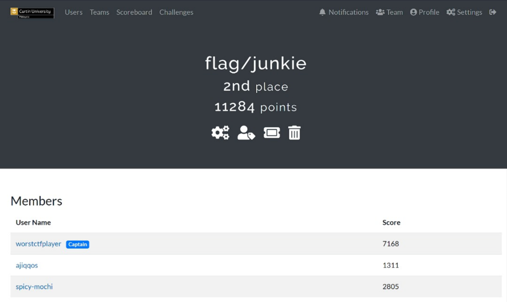

# BRabbit Lab

## Scenario

You are an investigator assigned to assist Drumbo, a company that recently fell victim to a ransomware attack. The attack began when an employee received an email that appeared to be from the boss. It featured the company’s logo and a familiar email address. Believing the email was legitimate, the employee opened the attachment, which compromised the system and deployed ransomware, encrypting sensitive files. Your task is to investigate and analyze the artifacts to uncover information about the attacker.



## Tools

* [https://www.emlreader.com/](https://www.emlreader.com/)
* [https://www.virustotal.com/gui/home/search](https://www.virustotal.com/gui/home/search)
* [https://app.any.run/](https://app.any.run/tasks/99f924a6-4dd1-4963-bc3f-f6863e14a585)
* [https://socprime.com/blog/security-advisory-bad-rabbit-ransomware-worm/](https://socprime.com/blog/security-advisory-bad-rabbit-ransomware-worm/)

<details>

<summary>Q1</summary>

The phishing email used to deliver the malicious attachment showed several indicators of a potential social engineering attempt. Recognizing these indicators can help identify similar threats in the future.
\
What is the suspicious email address that sent the attachment?

</details>

<details>

<summary>Answer</summary>

<figure><figcaption></figcaption></figure>

theceojamessmith@Drurnbo.com

</details>

<details>

<summary>Q2</summary>

The ransomware was identified as part of a known malware family. Determining its family name can provide critical insights into its behavior and remediation strategies.
\
What is the family name of the ransomware identified during the investigation?

</details>

I downloaded the file and rename it to .bin so I doesn't accidently run it. Then taking the hash and upload it to VT.

```bash
$ sha256sum Urgent\ Contract\ Action.pdf.exe.bin
630325cac09ac3fab908f903e3b00d0dadd5fdaa0875ed8496fcbb97a558d0da  Urgent Contract Action.pdf.exe.bin
```

<details>

<summary>Answer</summary>

<figure><figcaption></figcaption></figure>

Badrabbit

</details>

<details>

<summary>Q3</summary>

Upon execution, the ransomware dropped a file onto the compromised system to initiate its payload. Identifying this file is essential for understanding its infection process.
\
What is the name of the first file dropped by the ransomware?

</details>

Went to any.run for this

<details>

<summary>Answer</summary>

<figure><figcaption></figcaption></figure>

infpub.dat

</details>

<details>

<summary>Q4</summary>

Inside the dropped file, the malware contained hardcoded artifacts, including usernames and passwords that could provide clues about its origins or configuration.
\
What is the only person's username found within the dropped file?

</details>

<details>

<summary>Answer</summary>

As this is threat intel, I dont want to download the dropped file and investigate it myself, so googling the username can bring to blogs that mention about the username.

<figure><figcaption></figcaption></figure>

alex

</details>

<details>

<summary>Q5</summary>

After execution, the ransomware communicated with a C2 server. Recognizing its communication techniques can assist in mitigation.
\
What MITRE ATT\&CK sub-technique describes the ransomware’s use of web protocols for sending and receiving data?

</details>

<details>

<summary>Answer</summary>

Just a complete guess, which normally used by malware to transfer file via web server

T1071.001

</details>

<details>

<summary>Q6</summary>

Persistence mechanisms are a hallmark of sophisticated ransomware. Identifying how persistence was achieved can aid in recovery and prevention of reinfection.
\
What is the MITRE ATT\&CK Sub-Technique ID associated with the ransomware’s persistence technique?

</details>

<details>

<summary>Answer</summary>

<figure><figcaption></figcaption></figure>

</details>

<details>

<summary>Q7</summary>

As part of its infection chain, the ransomware created specific tasks to ensure its continued operation. Recognizing these tasks is crucial for system restoration. What are the names of the tasks created by the ransomware during execution?

</details>

<details>

<summary>Answer</summary>

<figure><figcaption></figcaption></figure>

dispci

</details>

<details>

<summary>Q8</summary>

the malicious binary `dispci.exe` displayed a **suspicious message** upon execution, urging users to disable their defenses. This tactic aimed to evade detection and enable the ransomware's full execution. What suspicious message was displayed in the Console upon executing this binary?

</details>

<details>

<summary>Answer</summary>

<figure><figcaption></figcaption></figure>

Disable your anti-virus and anti-malware programs

</details>

<details>

<summary>Q9</summary>

To modify the Master Boot Record (MBR) and encrypt the victim’s hard drive, the ransomware utilized a specific driver. Recognizing this driver is essential for understanding the encryption mechanism.
\
What is the name of the driver used to encrypt the hard drive and modify the MBR?

</details>

<details>

<summary>Answer</summary>

[https://www.group-ib.com/blog/reportbadrabbit/](https://www.group-ib.com/blog/reportbadrabbit/)

diskcryptor

</details>

<details>

<summary>Q10</summary>

Attribution is key to understanding the threat landscape. The ransomware was tied to a known attack group through its tactics, techniques, and procedures (TTPs).
\
What is the name of the threat actor responsible for this ransomware campaign?

</details>

<details>

<summary>Answer</summary>

[https://socprime.com/blog/security-advisory-bad-rabbit-ransomware-worm/#Threat\_Actor\_Attribution\_and\_TTP\_Analysis](https://socprime.com/blog/security-advisory-bad-rabbit-ransomware-worm/#Threat_Actor_Attribution_and_TTP_Analysis)

Sandworm

</details>

<details>

<summary>Q11</summary>

The ransomware rendered the system unbootable by corrupting critical system components. Identifying the technique used provides insight into its destructive capabilities.
\
What is the MITRE ATT\&CK ID for the technique used to corrupt the system firmware and prevent booting?

</details>

<details>

<summary>Answer</summary>

there is firmware corruption in mitre attack.

T1495

</details>
