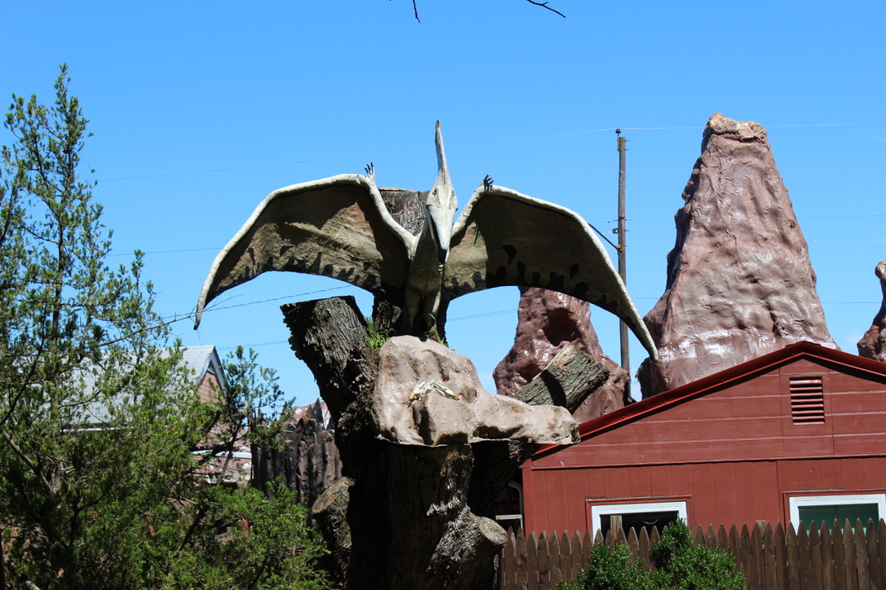

# Intel101 Lab

## Scenario

This exercise focuses on Open-Source Intelligence (OSINT) as a method for mining and analyzing publicly available data. It aims to enhance skills in producing valuable insights when investigating external threats in the role of a security blue team analyst. Through practical application, participants will learn to effectively gather and interpret information to improve overall security measures.



<figure><figcaption></figcaption></figure>

## Tools

* [https://www.whois.com/whois/](https://www.whois.com/whois/)
* [https://web.archive.org/](https://web.archive.org/)

Q1

Who is the Registrar for **jameskainth.com**?

Answer

[https://www.whois.com/whois/jameskainth.com](https://www.whois.com/whois/jameskainth.com)

Q2

What is the Zoom meeting id of the **British Prime Ministers** Cabinet Meeting?

Answer

<figure><figcaption></figcaption></figure>

539544323

Q3

In **1998** specifically on **February 12th**, Champlain was planning on adding an exciting new building to its campus. Back then, it was called “**The Information Commons**”. Can you find a picture of what the inside would look like? Submit the SHA256 hash.

Answer

[https://web.archive.org/web/19980212103349/https://www.champlain.edu/](https://web.archive.org/web/19980212103349/https://www.champlain.edu/)

Go to informations common projects

$ sha256sum inside1.jpg
\
f4952b314eb15acf0eec79c954f83881c17d50d2b5922ee37e8fc5e5cd1aeac2 inside1.jpg

Q4

In 2019 UVM’s Ichthyology Class Had to Name their fish for class. Can you find out what the last person on the public roster named their fish?

Answer

New technique unlock, filtering in wayback machine

<figure><figcaption></figcaption></figure>

&#x20;Saccopharyngiformes

Q5

Can you identify the state from which this picture was taken? See the attached photo.

Answer

Decided to skip this one because reversing the image gives cyberdefenders writeup and not the actual image

Dinosaur Land

